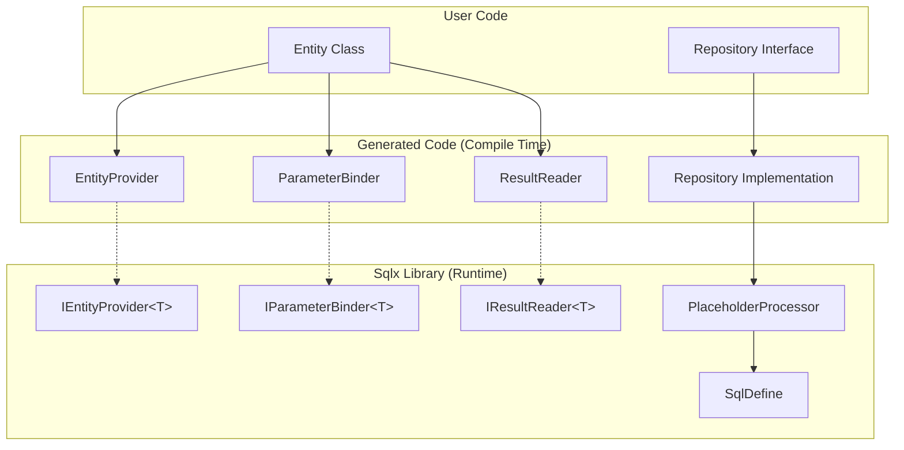

# Design Document: Converter Interfaces

## Overview

本设计将Sqlx的代码生成分解为三个独立的可复用组件，实现AOT兼容、高性能、使用简单的目标。

**核心组件：**
1. **IEntityProvider<TEntity>** - 实体元数据提供者
2. **IParameterBinder<TEntity>** - 参数绑定器
3. **IResultReader<TEntity>** - 结果读取器
4. **PlaceholderProcessor** - 占位符处理器（Sqlx库）

**执行流程：**
```
GetXxxSql() → SqlTemplate → ParameterBinder.BindEntity() → Execute → ResultReader.Read()
                                      ↓
                              OnExecuting() → Execute → OnExecuted()/OnExecuteFail()
```

## Architecture



## Components and Interfaces

### IEntityProvider

提供实体元数据，用于占位符处理。无泛型，通过Type属性标识实体类型。

```csharp
namespace Sqlx;

/// <summary>
/// Column metadata without reflection.
/// Name can be customized via [Column] attribute.
/// </summary>
public record ColumnMeta(
    string Name,         // SQL column name (from [Column] or snake_case of PropertyName)
    string PropertyName, // C# property name (PascalCase)
    DbType DbType,
    bool IsNullable
);

/// <summary>
/// Provides entity metadata for SQL generation without reflection.
/// </summary>
public interface IEntityProvider
{
    /// <summary>
    /// Gets the entity type this provider is for.
    /// </summary>
    Type EntityType { get; }
    
    /// <summary>
    /// Gets all column metadata for the entity.
    /// Column names respect [Column] attribute if present.
    /// </summary>
    IReadOnlyList<ColumnMeta> Columns { get; }
}
```

**生成的实现示例：**

```csharp
// 源生成器生成的代码
// 通过 [SqlxEntity] 特性触发生成
[SqlxEntity]
public class User
{
    public long Id { get; set; }
    
    [Column("user_name")]
    public string Name { get; set; }
    
    [Column("email_address")]
    public string? Email { get; set; }
    
    public DateTime CreatedAt { get; set; }
}

// 生成的 EntityProvider
public sealed class UserEntityProvider : IEntityProvider
{
    /// <summary>
    /// Default instance for use by generated code.
    /// </summary>
    public static readonly UserEntityProvider Default = new();
    
    /// <summary>
    /// Cached entity type to avoid repeated typeof calls.
    /// </summary>
    private static readonly Type _entityType = typeof(User);
    
    private static readonly IReadOnlyList<ColumnMeta> _columns = new ColumnMeta[]
    {
        new("id", "Id", DbType.Int64, false),
        new("user_name", "Name", DbType.String, false),  // [Column("user_name")]
        new("email_address", "Email", DbType.String, true), // [Column("email_address")]
        new("created_at", "CreatedAt", DbType.DateTime, false)
    };
    
    public Type EntityType => _entityType;
    
    public IReadOnlyList<ColumnMeta> Columns => _columns;
}
```

### IParameterBinder<TEntity>

参数绑定器，将实体绑定到DbCommand。最小接口，只需要核心绑定能力。

```csharp
namespace Sqlx;

/// <summary>
/// Binds entity parameters to DbCommand without reflection.
/// </summary>
/// <typeparam name="TEntity">The entity type.</typeparam>
public interface IParameterBinder<TEntity>
{
    /// <summary>
    /// Binds all entity properties as parameters to the command.
    /// </summary>
    /// <param name="command">The database command.</param>
    /// <param name="entity">The entity to bind.</param>
    /// <param name="parameterPrefix">The parameter prefix (e.g., "@", "$", ":").</param>
    void BindEntity(DbCommand command, TEntity entity, string parameterPrefix = "@");
}
```

**生成的实现示例：**

```csharp
// 源生成器生成的代码
// 通过 [SqlxParameter] 特性触发生成
public sealed class UserParameterBinder : IParameterBinder<User>
{
    /// <summary>
    /// Default instance for use by generated code.
    /// </summary>
    public static readonly UserParameterBinder Default = new();
    
    public void BindEntity(DbCommand command, User entity, string parameterPrefix = "@")
    {
        var p0 = command.CreateParameter();
        p0.ParameterName = parameterPrefix + "id";
        p0.DbType = DbType.Int64;
        p0.Value = entity.Id;
        command.Parameters.Add(p0);
        
        var p1 = command.CreateParameter();
        p1.ParameterName = parameterPrefix + "user_name"; // 使用[Column]指定的名字
        p1.DbType = DbType.String;
        p1.Value = entity.Name ?? (object)DBNull.Value;
        command.Parameters.Add(p1);
        
        // ... 其他属性
    }
}
```

### IResultReader<TEntity>

结果读取器，将DbDataReader映射为实体。返回IEnumerable/IAsyncEnumerable，使用LINQ进行后续操作。

```csharp
namespace Sqlx;

/// <summary>
/// Reads entities from DbDataReader without reflection.
/// Returns IEnumerable for flexible consumption with LINQ.
/// </summary>
/// <typeparam name="TEntity">The entity type.</typeparam>
public interface IResultReader<TEntity>
{
    /// <summary>
    /// Reads all entities from the reader as IEnumerable.
    /// Caller is responsible for reader lifecycle.
    /// Use LINQ methods like .ToList(), .FirstOrDefault() for further processing.
    /// </summary>
    /// <param name="reader">The data reader.</param>
    /// <returns>Enumerable of entities.</returns>
    IEnumerable<TEntity> Read(DbDataReader reader);
    
    /// <summary>
    /// Reads all entities from the reader as IAsyncEnumerable.
    /// Caller is responsible for reader lifecycle.
    /// Use LINQ methods like .ToListAsync(), .FirstOrDefaultAsync() for further processing.
    /// </summary>
    /// <param name="reader">The data reader.</param>
    /// <param name="cancellationToken">Cancellation token.</param>
    /// <returns>Async enumerable of entities.</returns>
    IAsyncEnumerable<TEntity> ReadAsync(DbDataReader reader, CancellationToken cancellationToken = default);
}

// 不需要扩展方法，使用LINQ：
// reader.Read(dataReader).ToList()
// reader.Read(dataReader).FirstOrDefault()
// await reader.ReadAsync(dataReader).ToListAsync()
// await reader.ReadAsync(dataReader).FirstOrDefaultAsync()
```

**生成的实现示例：**

```csharp
// 源生成器生成的代码
// 实体构建逻辑内联，避免参数过多
public sealed class UserResultReader : IResultReader<User>
{
    /// <summary>
    /// Default instance for use by generated code.
    /// </summary>
    public static readonly UserResultReader Default = new();
    
    public IEnumerable<User> Read(DbDataReader reader)
    {
        // 每次调用时获取列序号，避免并发问题
        var ordinalId = reader.GetOrdinal("id");
        var ordinalName = reader.GetOrdinal("user_name");
        var ordinalEmail = reader.GetOrdinal("email_address");
        var ordinalCreatedAt = reader.GetOrdinal("created_at");
        
        while (reader.Read())
        {
            // 内联实体构建，避免方法参数过多
            yield return new User
            {
                Id = reader.GetInt64(ordinalId),
                Name = reader.IsDBNull(ordinalName) ? null : reader.GetString(ordinalName),
                Email = reader.IsDBNull(ordinalEmail) ? null : reader.GetString(ordinalEmail),
                CreatedAt = reader.GetDateTime(ordinalCreatedAt)
            };
        }
    }
    
    public async IAsyncEnumerable<User> ReadAsync(
        DbDataReader reader, 
        [EnumeratorCancellation] CancellationToken cancellationToken = default)
    {
        var ordinalId = reader.GetOrdinal("id");
        var ordinalName = reader.GetOrdinal("user_name");
        var ordinalEmail = reader.GetOrdinal("email_address");
        var ordinalCreatedAt = reader.GetOrdinal("created_at");
        
        while (await reader.ReadAsync(cancellationToken))
        {
            yield return new User
            {
                Id = reader.GetInt64(ordinalId),
                Name = reader.IsDBNull(ordinalName) ? null : reader.GetString(ordinalName),
                Email = reader.IsDBNull(ordinalEmail) ? null : reader.GetString(ordinalEmail),
                CreatedAt = reader.GetDateTime(ordinalCreatedAt)
            };
        }
    }
}

### 自动生成触发方式

源生成器支持两种方式触发生成：

**方式1：标注实体类**

```csharp
// [SqlxEntity] - 生成 UserEntityProvider, UserResultReader
// [SqlxParameter] - 生成 UserParameterBinder
// 可以同时使用两个特性
[SqlxEntity]
[SqlxParameter]
public class User
{
    public long Id { get; set; }
    
    [Column("user_name")]
    public string Name { get; set; }
    
    [Column("email_address")]
    public string? Email { get; set; }
    
    public DateTime CreatedAt { get; set; }
}
```

**方式2：通过Repository接口推断**

```csharp
// 通过 ICrudRepository<User, long> 推断实体类型
// 自动生成 UserEntityProvider, UserParameterBinder, UserResultReader
public interface IUserRepository : ICrudRepository<User, long>
{
    [SqlTemplate("SELECT {{columns}} FROM users WHERE status = @status")]
    Task<List<User>> GetByStatusAsync(string status, CancellationToken ct = default);
}
```

**生成规则：**
- 每个实体类型只生成一次（去重）
- `[SqlxEntity]` 生成 EntityProvider 和 ResultReader
- `[SqlxParameter]` 生成 ParameterBinder
- 支持`[Column]`特性自定义列名
- 支持`[IgnoreDataMember]`特性排除属性

### 预编译SqlTemplate

Repository方法的SqlTemplate采用两阶段渲染策略，优化效率和GC。

**SqlTemplate的两个作用：**
1. **Prepare（准备）** - 编译时固定的占位符（如{{columns}}, {{values}}, {{table}}），只处理一次存入静态字段
2. **Render（渲染）** - 运行时变化的占位符（如{{where}}, {{limit}}），每次执行前渲染，返回可直接执行的SQL

**两阶段处理策略：**
```
静态字段初始化时：Template → Prepare() → PreparedSql + HasDynamicPlaceholders (只执行一次)
方法执行时：
  - 如果 HasDynamicPlaceholders = false：直接使用 PreparedSql
  - 如果 HasDynamicPlaceholders = true：PreparedSql → Render() → Sql
```

```csharp
// SqlTemplate增强 - 支持两阶段渲染
namespace Sqlx;

/// <summary>
/// Parameter metadata for SQL execution.
/// </summary>
public record ParameterMeta(
    string Name,         // Parameter name (e.g., "status", "id")
    DbType DbType,       // Database type
    bool IsNullable      // Whether the parameter can be null
);

/// <summary>
/// Placeholder types for rendering strategy.
/// </summary>
public enum PlaceholderType
{
    /// <summary>
    /// Static placeholders are rendered once at initialization.
    /// Examples: {{columns}}, {{values}}, {{set}}, {{table}}
    /// </summary>
    Static,
    
    /// <summary>
    /// Dynamic placeholders are rendered before each execution.
    /// Examples: {{where}}, {{limit}}, {{offset}}
    /// </summary>
    Dynamic
}

public readonly record struct SqlTemplate
{
    /// <summary>
    /// Original SQL template with all placeholders.
    /// </summary>
    public string Template { get; init; }
    
    /// <summary>
    /// SQL after Prepare (may still contain dynamic placeholders).
    /// This is computed once and cached in static field.
    /// </summary>
    public string PreparedSql { get; init; }
    
    /// <summary>
    /// Final SQL ready for execution (after Render).
    /// For templates without dynamic placeholders, this equals PreparedSql.
    /// </summary>
    public string Sql { get; init; }
    
    /// <summary>
    /// Whether the template contains dynamic placeholders (where, limit, offset).
    /// Computed once during Prepare and cached.
    /// </summary>
    public bool HasDynamicPlaceholders { get; init; }
    
    /// <summary>
    /// Static parameter metadata extracted from template during Prepare.
    /// These are parameters like @status, @id that appear directly in the template.
    /// Extracted by PlaceholderProcessor during Prepare, not by source generator.
    /// Type information comes from method parameter types (provided in context).
    /// </summary>
    public IReadOnlyList<ParameterMeta> StaticParameters { get; init; }
    
    /// <summary>
    /// Prepares the template - processes static placeholders only.
    /// Called once during static field initialization.
    /// Thread-safe, returns new instance.
    /// Also detects and caches whether dynamic placeholders exist.
    /// </summary>
    /// <param name="context">Placeholder context with entity metadata and SQL dialect.</param>
    /// <returns>New SqlTemplate with PreparedSql and HasDynamicPlaceholders populated.</returns>
    public SqlTemplate Prepare(PlaceholderContext context)
    {
        // Process static placeholders and extract static parameters
        var (preparedSql, staticParams) = PlaceholderProcessor.Default.Prepare(Template, context);
        var hasDynamic = PlaceholderProcessor.ContainsDynamicPlaceholders(preparedSql);
        
        return this with 
        { 
            PreparedSql = preparedSql,
            HasDynamicPlaceholders = hasDynamic,
            StaticParameters = staticParams,
            // If no dynamic placeholders, Sql is ready to use
            Sql = hasDynamic ? string.Empty : preparedSql
        };
    }
    
    /// <summary>
    /// Renders dynamic placeholders.
    /// Called before each execution only if HasDynamicPlaceholders is true.
    /// Thread-safe, returns new instance.
    /// </summary>
    /// <param name="context">Placeholder context with dynamic parameters.</param>
    /// <returns>New SqlTemplate with final Sql populated.</returns>
    public SqlTemplate Render(PlaceholderContext context)
    {
        // Caller should check HasDynamicPlaceholders first
        // If called when no dynamic placeholders, just return with PreparedSql
        if (!HasDynamicPlaceholders)
        {
            return this with { Sql = PreparedSql };
        }
        
        var finalSql = PlaceholderProcessor.Default.Render(PreparedSql, context);
        return this with { Sql = finalSql };
    }
    
    /// <summary>
    /// Binds static parameters to the DbCommand using the provided values.
    /// Static parameters are extracted from template during Prepare.
    /// </summary>
    /// <param name="command">The database command.</param>
    /// <param name="parameterValues">Parameter values to bind.</param>
    /// <param name="parameterPrefix">The parameter prefix (e.g., "@", "$", ":").</param>
    public void BindParameters(DbCommand command, IReadOnlyDictionary<string, object?> parameterValues, string parameterPrefix = "@")
    {
        if (StaticParameters == null || StaticParameters.Count == 0) return;
        
        foreach (var meta in StaticParameters)
        {
            var p = command.CreateParameter();
            p.ParameterName = parameterPrefix + meta.Name;
            p.DbType = meta.DbType;
            
            if (parameterValues.TryGetValue(meta.Name, out var value))
            {
                p.Value = value ?? DBNull.Value;
            }
            else
            {
                throw new InvalidOperationException(
                    $"Parameter '{meta.Name}' not found in parameter values");
            }
            
            command.Parameters.Add(p);
        }
    }
}
```

```csharp
// 用户定义的接口 - 只定义异步方法
public interface IUserRepository : ICrudRepository<User, long>
{
    [SqlTemplate("SELECT {{columns}} FROM users WHERE status = @status")]
    Task<List<User>> GetByStatusAsync(string status, CancellationToken ct = default);
    
    [SqlTemplate("SELECT {{columns}} FROM users WHERE {{where --param predicate}} {{limit --param limit}}")]
    Task<List<User>> GetWhereAsync(Expression<Func<User, bool>> predicate, int limit = 100, CancellationToken ct = default);
}

// 生成的Repository实现
public partial class UserRepository
{
    // PlaceholderContext - 可复用
    private static readonly PlaceholderContext _placeholderContext = new PlaceholderContext
    {
        SqlDefine = SqlDefine.SQLite,
        TableName = "users",
        Columns = UserEntityProvider.Default.Columns
    };
    
    // ========== 静态模板 - 在静态字段初始化时进行静态渲染 ==========
    
    // GetByStatusAsync: 只有静态占位符 {{columns}}，Prepare后SQL完整
    // HasDynamicPlaceholders = false，Sql已经可用
    // StaticParameters 由 PlaceholderProcessor 从模板中的 @status 提取
    private static readonly SqlTemplate _getByStatusAsyncTemplate = new SqlTemplate
    {
        Template = "SELECT {{columns}} FROM users WHERE status = @status"
    }.Prepare(_placeholderContext);  // Prepare一次，StaticParameters由引擎提取
    
    // GetWhereAsync: 包含动态占位符 {{where}}, {{limit}}
    // HasDynamicPlaceholders = true，需要每次执行前Render
    // 注意：此模板没有显式的 @param，参数来自 ExpressionToSql 和动态占位符
    private static readonly SqlTemplate _getWhereAsyncTemplate = new SqlTemplate
    {
        Template = "SELECT {{columns}} FROM users WHERE {{where --param predicate}} {{limit --param limit}}"
    }.Prepare(_placeholderContext);  // Prepare {{columns}}，HasDynamicPlaceholders=true，StaticParameters由引擎提取
    
    // ========== 方法实现 ==========
    
    // 只生成异步版本（接口定义的是异步）
    public async Task<List<User>> GetByStatusAsync(string status, CancellationToken ct = default)
    {
        var startTime = Stopwatch.GetTimestamp();
        
        // 此模板 HasDynamicPlaceholders = false，直接使用 Sql
        var template = _getByStatusAsyncTemplate;
        
#if !SQLX_DISABLE_ACTIVITY
        // 获取Activity并添加开始事件，设置固定标签
        var activity = global::System.Diagnostics.Activity.Current?.AddEvent(new ActivityEvent("GetByStatusAsync"));
        activity?.SetTag("db.system", "sqlite");
        activity?.SetTag("db.operation", "sqlx.execute");
        activity?.SetTag("db.has_transaction", Transaction != null);
#if !SQLX_DISABLE_ACTIVITY_PARAMS
        activity?.SetTag("db.param.status", status);
#endif
#endif
        
        // 构建参数字典
        var parameters = new Dictionary<string, object?>
        {
            ["status"] = status
        };
        
        using var cmd = _connection.CreateCommand();
        
        if (Transaction != null)
        {
            cmd.Transaction = Transaction;
        }
        
        cmd.CommandText = template.Sql;
        
        // 使用SqlTemplate的BindParameters方法绑定静态参数
        template.BindParameters(cmd, parameters, _placeholderContext.ParameterPrefix);
        
#if !SQLX_DISABLE_INTERCEPTOR
        OnExecuting("GetByStatusAsync", cmd, template);
#endif
        
        try
        {
            using var reader = await cmd.ExecuteReaderAsync(ct);
            var result = await UserResultReader.Default.ReadAsync(reader, ct).ToListAsync(ct);
            
#if !SQLX_DISABLE_INTERCEPTOR
            var elapsed = Stopwatch.GetTimestamp() - startTime;
            OnExecuted("GetByStatusAsync", cmd, template, result, elapsed);
#endif
            
#if !SQLX_DISABLE_ACTIVITY
            // 集合结果设置条数
            activity?.SetTag("db.rows_affected", result.Count);
#endif
            
            return result;
        }
        catch (Exception ex)
        {
#if !SQLX_DISABLE_INTERCEPTOR
            var elapsed = Stopwatch.GetTimestamp() - startTime;
            OnExecuteFail("GetByStatusAsync", cmd, template, ex, elapsed);
#endif
            
#if !SQLX_DISABLE_ACTIVITY
            // 失败时设置Status
            activity?.SetStatus(ActivityStatusCode.Error, ex.Message);
#endif
            throw;
        }
        finally
        {
#if !SQLX_DISABLE_ACTIVITY
            // 耗时和SQL在finally里设置
            var elapsed = Stopwatch.GetTimestamp() - startTime;
            var durationMs = elapsed * 1000.0 / Stopwatch.Frequency;
            activity?.SetTag("db.duration_ms", durationMs);
            activity?.SetTag("db.statement.template", template.Template);
            activity?.SetTag("db.statement.prepared", template.PreparedSql);
            activity?.SetTag("db.statement", template.Sql);
#endif
        }
    }
    
    // 动态WHERE和LIMIT示例
    public async Task<List<User>> GetWhereAsync(Expression<Func<User, bool>> predicate, int limit = 100, CancellationToken ct = default)
    {
        var startTime = Stopwatch.GetTimestamp();
        
        // 创建动态上下文 - 把所有参数都列进去，简单直接
        var dynamicContext = _placeholderContext with
        {
            DynamicParameters = new Dictionary<string, object?>
            {
                ["predicate"] = predicate.ToWhereClause(_placeholderContext.SqlDefine),
                ["limit"] = limit
            }
        };
        
        // 此模板 HasDynamicPlaceholders = true，需要Render
        var template = _getWhereAsyncTemplate.Render(dynamicContext);
        
#if !SQLX_DISABLE_ACTIVITY
        // 获取Activity并添加开始事件，设置固定标签
        var activity = global::System.Diagnostics.Activity.Current?.AddEvent(new ActivityEvent("GetWhereAsync"));
        activity?.SetTag("db.system", "sqlite");
        activity?.SetTag("db.operation", "sqlx.execute");
        activity?.SetTag("db.has_transaction", Transaction != null);
#if !SQLX_DISABLE_ACTIVITY_PARAMS
        // 把DynamicParameters作为db.param.{参数名}设置到activity上
        foreach (var param in dynamicContext.DynamicParameters)
        {
            activity?.SetTag($"db.param.{param.Key}", param.Value);
        }
#endif
#endif
        
        using var cmd = _connection.CreateCommand();
        
        if (Transaction != null)
        {
            cmd.Transaction = Transaction;
        }
        
        cmd.CommandText = template.Sql;
        
#if !SQLX_DISABLE_INTERCEPTOR
        OnExecuting("GetWhereAsync", cmd, template);
#endif
        
        try
        {
            using var reader = await cmd.ExecuteReaderAsync(ct);
            var result = await UserResultReader.Default.ReadAsync(reader, ct).ToListAsync(ct);
            
#if !SQLX_DISABLE_INTERCEPTOR
            var elapsed = Stopwatch.GetTimestamp() - startTime;
            OnExecuted("GetWhereAsync", cmd, template, result, elapsed);
#endif
            
#if !SQLX_DISABLE_ACTIVITY
            // 集合结果设置条数
            activity?.SetTag("db.rows_affected", result.Count);
#endif
            
            return result;
        }
        catch (Exception ex)
        {
#if !SQLX_DISABLE_INTERCEPTOR
            var elapsed = Stopwatch.GetTimestamp() - startTime;
            OnExecuteFail("GetWhereAsync", cmd, template, ex, elapsed);
#endif
            
#if !SQLX_DISABLE_ACTIVITY
            // 失败时设置Status
            activity?.SetStatus(ActivityStatusCode.Error, ex.Message);
#endif
            throw;
        }
        finally
        {
#if !SQLX_DISABLE_ACTIVITY
            // 耗时和SQL在finally里设置
            var elapsed = Stopwatch.GetTimestamp() - startTime;
            var durationMs = elapsed * 1000.0 / Stopwatch.Frequency;
            activity?.SetTag("db.duration_ms", durationMs);
            activity?.SetTag("db.statement.template", template.Template);
            activity?.SetTag("db.statement.prepared", template.PreparedSql);
            activity?.SetTag("db.statement", template.Sql);
#endif
        }
    }
    
#if !SQLX_DISABLE_INTERCEPTOR
    // 拦截器 partial methods
    partial void OnExecuting(string operationName, DbCommand command, SqlTemplate template);
    partial void OnExecuted(string operationName, DbCommand command, SqlTemplate template, object? result, long elapsedTicks);
    partial void OnExecuteFail(string operationName, DbCommand command, SqlTemplate template, Exception exception, long elapsedTicks);
#endif
}
```

**设计特点：**
- **两阶段处理**：Prepare在静态字段初始化时执行一次，Render仅在HasDynamicPlaceholders=true时执行
- **HasDynamicPlaceholders属性**：在Prepare时计算并缓存，避免每次执行时判断
- **静态占位符**：{{columns}}, {{values}}, {{set}}, {{table}} - 编译时固定，只处理一次
- **动态占位符**：{{where}}, {{limit}}, {{offset}} - 运行时变化，每次执行前渲染
- **Render返回可执行SQL**：StaticRender后如果无动态占位符，Sql已可用；否则DynamicRender后Sql可用
- **无WithParameter**：参数通过BindParameters方法直接绑定，不存储在SqlTemplate中
- **线程安全**：SqlTemplate是不可变的record struct
- **最小GC**：静态渲染结果缓存，HasDynamicPlaceholders避免重复检测

**Activity跟踪（通过编译常数控制）：**
- `SQLX_DISABLE_ACTIVITY` - 禁用Activity跟踪（默认不定义，即默认开启）
- `SQLX_DISABLE_ACTIVITY_PARAMS` - 禁用参数记录（默认不定义，即默认开启；可能包含敏感数据时定义此常数）
- 使用`#if !SQLX_DISABLE_ACTIVITY`，默认开启Activity跟踪
- 获取Activity并添加事件：`var activity = global::System.Diagnostics.Activity.Current?.AddEvent(new ActivityEvent("方法名"))`
- Event名字是方法名（如`GetByStatusAsync`）
- 固定标签提前设置：db.system, db.operation(`sqlx.execute`), db.has_transaction
- 参数标签：遍历DynamicParameters，设置`db.param.{参数名}`
- 成功时设置：db.rows_affected（集合结果）
- 失败时调用`activity?.SetStatus(ActivityStatusCode.Error, ex.Message)`
- finally里设置：db.duration_ms, db.statement.template, db.statement.prepared, db.statement

**拦截器（通过编译常数控制）：**
- `SQLX_DISABLE_INTERCEPTOR` - 禁用拦截器（默认不定义，即默认开启）
- 使用`#if !SQLX_DISABLE_INTERCEPTOR`，默认开启拦截器
- 只生成接口定义的方法（异步就异步，同步就同步）
```

### PlaceholderProcessor

占位符处理器，在Sqlx库中实现，支持多方言、两阶段渲染和可扩展。

```csharp
namespace Sqlx;

/// <summary>
/// Context for placeholder processing.
/// </summary>
public class PlaceholderContext
{
    public SqlDefine SqlDefine { get; init; }
    public string TableName { get; init; }
    public IReadOnlyList<ColumnMeta> Columns { get; init; }
    public string ParameterPrefix => SqlDefine.ParameterPrefix;
    public Func<string, string> QuoteColumn => SqlDefine.WrapColumn;
    
    /// <summary>
    /// Dynamic parameters for runtime placeholders (where, limit, offset).
    /// </summary>
    public IReadOnlyDictionary<string, object?>? DynamicParameters { get; init; }
}

/// <summary>
/// Handler for a specific placeholder type.
/// </summary>
public interface IPlaceholderHandler
{
    /// <summary>
    /// The placeholder name (e.g., "columns", "values", "set").
    /// </summary>
    string Name { get; }
    
    /// <summary>
    /// Whether this is a static placeholder (rendered once) or dynamic (rendered each execution).
    /// </summary>
    PlaceholderType Type { get; }
    
    /// <summary>
    /// Processes the placeholder and returns the replacement SQL.
    /// <summary>
    /// Determines the placeholder type based on options.
    /// For example, {{limit --count 1}} is static, {{limit --param limit}} is dynamic.
    /// </summary>
    PlaceholderType GetType(string? options);
    
    /// <summary>
    /// Processes the placeholder and returns the replacement SQL.
    /// </summary>
    string Process(PlaceholderContext context, string? options);
}

/// <summary>
/// Base class for placeholder handlers to avoid duplicate code.
/// </summary>
public abstract partial class PlaceholderHandlerBase : IPlaceholderHandler
{
    public abstract string Name { get; }
    
    /// <summary>
    /// Default implementation returns Static. Override for placeholders that can be either.
    /// </summary>
    public virtual PlaceholderType GetType(string? options) => PlaceholderType.Static;
    
    public abstract string Process(PlaceholderContext context, string? options);
    
    /// <summary>
    /// Parses a named option value from options string.
    /// Example: ParseOption("--param status --count 10", "param") returns "status"
    /// </summary>
    protected static string? ParseOption(string? options, string optionName)
    {
        if (string.IsNullOrEmpty(options)) return null;
        var match = OptionRegex().Match(options.Replace($"--{optionName}", "\x00"));
        if (match.Success && options.Contains($"--{optionName}"))
        {
            // Find the value after --{optionName}
            var pattern = $@"--{optionName}\s+(\S+)";
            var specificMatch = System.Text.RegularExpressions.Regex.Match(options, pattern);
            return specificMatch.Success ? specificMatch.Groups[1].Value : null;
        }
        return null;
    }
    
    /// <summary>
    /// Checks if an option flag exists in options string.
    /// Example: HasOption("--param status --nullable", "nullable") returns true
    /// </summary>
    protected static bool HasOption(string? options, string optionName)
    {
        if (string.IsNullOrEmpty(options)) return false;
        return options.Contains($"--{optionName}");
    }
    
    /// <summary>
    /// Gets dynamic parameter value from context, throws if not found or null.
    /// </summary>
    protected static string GetDynamicParameterValue(PlaceholderContext context, string paramName, string placeholderName)
    {
        if (context.DynamicParameters?.TryGetValue(paramName, out var value) == true)
        {
            return value?.ToString() 
                ?? throw new InvalidOperationException($"Dynamic parameter '{paramName}' has null value for {{{{{placeholderName}}}}} placeholder");
        }
        
        throw new InvalidOperationException(
            $"Dynamic parameter '{paramName}' not found in context for {{{{{placeholderName}}}}} placeholder");
    }
    
    /// <summary>
    /// Parses --param option from options string.
    /// </summary>
    protected static string? ParseParamOption(string? options)
    {
        if (string.IsNullOrEmpty(options)) return null;
        var match = ParamOptionRegex().Match(options);
        return match.Success ? match.Groups[1].Value : null;
    }
    
    /// <summary>
    /// Parses --count option from options string.
    /// </summary>
    protected static string? ParseCountOption(string? options)
    {
        if (string.IsNullOrEmpty(options)) return null;
        var match = CountOptionRegex().Match(options);
        return match.Success ? match.Groups[1].Value : null;
    }
    
    /// <summary>
    /// Parses --exclude option from options string.
    /// Returns array of excluded column names.
    /// </summary>
    protected static string[] ParseExcludeOption(string? options)
    {
        if (string.IsNullOrEmpty(options)) return Array.Empty<string>();
        
        var match = ExcludeOptionRegex().Match(options);
        if (match.Success)
        {
            return match.Groups[1].Value.Split(',', StringSplitOptions.RemoveEmptyEntries);
        }
        return Array.Empty<string>();
    }
    
    /// <summary>
    /// Gets columns after applying exclude filter.
    /// </summary>
    protected static IEnumerable<ColumnMeta> GetFilteredColumns(PlaceholderContext context, string? options)
    {
        var exclude = ParseExcludeOption(options);
        if (exclude.Length == 0) return context.Columns;
        
        return context.Columns.Where(c => 
            !exclude.Contains(c.Name, StringComparer.OrdinalIgnoreCase) &&
            !exclude.Contains(c.PropertyName, StringComparer.OrdinalIgnoreCase));
    }
    
    // Source-generated regex for common option patterns
    [GeneratedRegex(@"--(\w+)\s+(\S+)", RegexOptions.Compiled)]
    private static partial Regex OptionRegex();
    
    [GeneratedRegex(@"--param\s+(\S+)", RegexOptions.Compiled)]
    private static partial Regex ParamOptionRegex();
    
    [GeneratedRegex(@"--count\s+(\d+)", RegexOptions.Compiled)]
    private static partial Regex CountOptionRegex();
    
    [GeneratedRegex(@"--exclude\s+(\S+)", RegexOptions.Compiled)]
    private static partial Regex ExcludeOptionRegex();
}

/// <summary>
/// Processes SQL templates with placeholders.
/// Supports two-phase rendering: static (once) and dynamic (each execution).
/// </summary>
public partial class PlaceholderProcessor
{
    /// <summary>
    /// Default instance with all built-in handlers registered.
    /// </summary>
    public static readonly PlaceholderProcessor Default = new();
    
    private readonly Dictionary<string, IPlaceholderHandler> _handlers = new(StringComparer.OrdinalIgnoreCase);
    
    public PlaceholderProcessor()
    {
        // Register built-in static handlers
        RegisterHandler(new ColumnsPlaceholderHandler());   // Static
        RegisterHandler(new ValuesPlaceholderHandler());    // Static
        RegisterHandler(new SetPlaceholderHandler());       // Static
        RegisterHandler(new TablePlaceholderHandler());     // Static
        
        // Register built-in dynamic handlers
        RegisterHandler(new WherePlaceholderHandler());     // Dynamic
        RegisterHandler(new LimitPlaceholderHandler());     // Dynamic
        RegisterHandler(new OffsetPlaceholderHandler());    // Dynamic
    }
    
    /// <summary>
    /// Registers a custom placeholder handler.
    /// </summary>
    public void RegisterHandler(IPlaceholderHandler handler)
    {
        _handlers[handler.Name] = handler;
    }
    
    /// <summary>
    /// Checks if the SQL contains any dynamic placeholders.
    /// Called once during Prepare to cache the result.
    /// </summary>
    public static bool ContainsDynamicPlaceholders(string sql)
    {
        // Quick check for {{ before doing regex
        if (!sql.Contains("{{")) return false;
        return DynamicPlaceholderRegex().IsMatch(sql);
    }
    
    /// <summary>
    /// Prepares the template - processes static placeholders only.
    /// Called once during static field initialization.
    /// </summary>
    public (string sql, IReadOnlyList<ParameterMeta> parameters) Prepare(string template, PlaceholderContext context)
    {
        var sql = PlaceholderRegex().Replace(
            template,
            match =>
            {
                var name = match.Groups[1].Value;
                var options = match.Groups[2].Success ? match.Groups[2].Value : null;
                
                if (_handlers.TryGetValue(name, out var handler))
                {
                    // Only process static placeholders based on options
                    if (handler.GetType(options) == PlaceholderType.Static)
                    {
                        return handler.Process(context, options);
                    }
                    // Keep dynamic placeholders unchanged
                    return match.Value;
                }
                
                // Unknown placeholder - throw error
                throw new InvalidOperationException(
                    $"Unknown placeholder '{{{{{name}}}}}'. " +
                    $"Available placeholders: {string.Join(", ", _handlers.Keys)}");
            });
        
        // Extract static parameters from SQL (e.g., @status, @id)
        var parameters = ExtractParameters(sql, context);
        return (sql, parameters);
    }
    
    /// <summary>
    /// Renders dynamic placeholders (where, limit, offset).
    /// Called before each execution. Performance-critical - avoid allocations.
    /// </summary>
    public string Render(string preparedSql, PlaceholderContext context)
    {
        // Quick check - if no {{ then no placeholders to process
        if (!preparedSql.Contains("{{")) return preparedSql;
        
        return PlaceholderRegex().Replace(
            preparedSql,
            match =>
            {
                var name = match.Groups[1].Value;
                var options = match.Groups[2].Success ? match.Groups[2].Value : null;
                
                if (_handlers.TryGetValue(name, out var handler))
                {
                    // Only process dynamic placeholders based on options
                    if (handler.GetType(options) == PlaceholderType.Dynamic)
                    {
                        return handler.Process(context, options);
                    }
                    // Static placeholders should already be processed
                    return match.Value;
                }
                
                // Unknown placeholder - throw error
                throw new InvalidOperationException(
                    $"Unknown placeholder '{{{{{name}}}}}'. " +
                    $"Available placeholders: {string.Join(", ", _handlers.Keys)}");
            });
    }
    
    /// <summary>
    /// Source-generated regex for placeholder matching.
    /// </summary>
    [GeneratedRegex(@"\{\{(\w+)(?:\s+([^}]+))?\}\}", RegexOptions.Compiled)]
    private static partial Regex PlaceholderRegex();
    
    /// <summary>
    /// Source-generated regex for detecting dynamic placeholders.
    /// </summary>
    [GeneratedRegex(@"\{\{(where|limit|offset)(?:\s+[^}]+)?\}\}", RegexOptions.Compiled | RegexOptions.IgnoreCase)]
    private static partial Regex DynamicPlaceholderRegex();
}
```

### 分析器 (Analyzer)

提供最佳实践引导和编译时错误检查。

```csharp
namespace Sqlx.Analyzers;

/// <summary>
/// Analyzer for Sqlx best practices.
/// </summary>
[DiagnosticAnalyzer(LanguageNames.CSharp)]
public class SqlxAnalyzer : DiagnosticAnalyzer
{
    // SQLX001: Entity class should have [SqlxEntity] or [SqlxParameter] attribute
    public static readonly DiagnosticDescriptor MissingGenerateConverters = new(
        "SQLX001",
        "Missing [SqlxEntity] or [SqlxParameter] attribute",
        "Entity type '{0}' used in repository should have [SqlxEntity] and/or [SqlxParameter] attribute for optimal performance",
        "Usage",
        DiagnosticSeverity.Info,
        isEnabledByDefault: true);
    
    // SQLX002: Unknown placeholder in SqlTemplate
    public static readonly DiagnosticDescriptor UnknownPlaceholder = new(
        "SQLX002",
        "Unknown placeholder",
        "Unknown placeholder '{{{{{{0}}}}}}' in SqlTemplate. Available: columns, values, set, table, limit, offset",
        "Usage",
        DiagnosticSeverity.Error,
        isEnabledByDefault: true);
    
    // SQLX003: Missing [Column] attribute for non-standard column name
    public static readonly DiagnosticDescriptor MissingColumnAttribute = new(
        "SQLX003",
        "Consider adding [Column] attribute",
        "Property '{0}' will be mapped to column '{1}'. Add [Column] attribute if different name is needed",
        "Usage",
        DiagnosticSeverity.Info,
        isEnabledByDefault: true);
}
```
```

### 内置占位符处理器

```csharp
/// <summary>
/// {{columns}} - 生成列名列表
/// {{columns --exclude Id}} - 排除指定列
/// </summary>
public class ColumnsPlaceholderHandler : PlaceholderHandlerBase
{
    public override string Name => "columns";
    
    public override string Process(PlaceholderContext context, string? options)
    {
        var columns = GetFilteredColumns(context, options);
        return string.Join(", ", columns.Select(c => context.QuoteColumn(c.Name)));
    }
}

/// <summary>
/// {{values}} - 生成参数占位符列表
/// {{values --exclude Id}} - 排除指定列
/// </summary>
public class ValuesPlaceholderHandler : PlaceholderHandlerBase
{
    public override string Name => "values";
    
    public override string Process(PlaceholderContext context, string? options)
    {
        var columns = GetFilteredColumns(context, options);
        return string.Join(", ", columns.Select(c => context.ParameterPrefix + c.Name));
    }
}

/// <summary>
/// {{set}} - 生成 column = @column 列表
/// {{set --exclude Id}} - 排除指定列
/// </summary>
public class SetPlaceholderHandler : PlaceholderHandlerBase
{
    public override string Name => "set";
    
    public override string Process(PlaceholderContext context, string? options)
    {
        var columns = GetFilteredColumns(context, options);
        return string.Join(", ", columns.Select(c => 
            $"{context.QuoteColumn(c.Name)} = {context.ParameterPrefix}{c.Name}"));
    }
}

/// <summary>
/// {{table}} - 生成表名 (Static)
/// </summary>
public class TablePlaceholderHandler : PlaceholderHandlerBase
{
    public override string Name => "table";
    
    public override string Process(PlaceholderContext context, string? options)
    {
        return context.TableName;
    }
}

/// <summary>
/// {{where --param predicate}} - 生成WHERE子句 (Dynamic)
/// </summary>
public class WherePlaceholderHandler : PlaceholderHandlerBase
{
    public override string Name => "where";
    
    // where 总是动态的，因为依赖运行时表达式
    public override PlaceholderType GetType(string? options) => PlaceholderType.Dynamic;
    
    public override string Process(PlaceholderContext context, string? options)
    {
        var paramName = ParseParamOption(options) 
            ?? throw new InvalidOperationException(
                $"{{{{where}}}} placeholder requires --param option. Options provided: '{options}'");
        
        return GetDynamicParameterValue(context, paramName, "where");
    }
}

/// <summary>
/// {{limit --param limit}} - 生成LIMIT子句 (Dynamic，依赖运行时参数)
/// {{limit --count 10}} - 生成固定LIMIT (Static，编译时固定)
/// </summary>
public class LimitPlaceholderHandler : PlaceholderHandlerBase
{
    public override string Name => "limit";
    
    /// <summary>
    /// --count 是静态的，--param 是动态的
    /// </summary>
    public override PlaceholderType GetType(string? options)
    {
        // 如果有 --count 选项，则是静态的
        if (!string.IsNullOrEmpty(options) && options.Contains("--count"))
        {
            return PlaceholderType.Static;
        }
        // 否则是动态的（需要 --param）
        return PlaceholderType.Dynamic;
    }
    
    public override string Process(PlaceholderContext context, string? options)
    {
        // Parse --param or --count option
        var paramName = ParseParamOption(options);
        string? limitValue = null;
        
        if (paramName != null)
        {
            if (context.DynamicParameters?.TryGetValue(paramName, out var value) == true)
            {
                limitValue = value?.ToString() 
                    ?? throw new InvalidOperationException($"Dynamic parameter '{paramName}' has null value for {{{{limit}}}} placeholder");
            }
            else
            {
                throw new InvalidOperationException(
                    $"Dynamic parameter '{paramName}' not found in context for {{{{limit}}}} placeholder");
            }
        }
        else
        {
            limitValue = ParseCountOption(options);
            if (limitValue == null)
            {
                throw new InvalidOperationException(
                    $"{{{{limit}}}} placeholder requires --param or --count option. Options provided: '{options}'");
            }
        }
        
        // 根据方言生成不同的LIMIT语法
        return context.SqlDefine.GenerateLimit(limitValue);
    }
}

/// <summary>
/// {{offset --param offset}} - 生成OFFSET子句 (Dynamic，依赖运行时参数)
/// {{offset --count 10}} - 生成固定OFFSET (Static，编译时固定)
/// </summary>
public class OffsetPlaceholderHandler : PlaceholderHandlerBase
{
    public override string Name => "offset";
    
    /// <summary>
    /// --count 是静态的，--param 是动态的
    /// </summary>
    public override PlaceholderType GetType(string? options)
    {
        if (!string.IsNullOrEmpty(options) && options.Contains("--count"))
        {
            return PlaceholderType.Static;
        }
        return PlaceholderType.Dynamic;
    }
    
    public override string Process(PlaceholderContext context, string? options)
    {
        var paramName = ParseParamOption(options);
        string? offsetValue = null;
        
        if (paramName != null)
        {
            if (context.DynamicParameters?.TryGetValue(paramName, out var value) == true)
            {
                offsetValue = value?.ToString() 
                    ?? throw new InvalidOperationException($"Dynamic parameter '{paramName}' has null value for {{{{offset}}}} placeholder");
            }
            else
            {
                throw new InvalidOperationException(
                    $"Dynamic parameter '{paramName}' not found in context for {{{{offset}}}} placeholder");
            }
        }
        else
        {
            offsetValue = ParseCountOption(options);
            if (offsetValue == null)
            {
                throw new InvalidOperationException(
                    $"{{{{offset}}}} placeholder requires --param or --count option. Options provided: '{options}'");
            }
        }
        
        return context.SqlDefine.GenerateOffset(offsetValue);
    }
}
```

## Data Models

### ColumnInfo

```csharp
namespace Sqlx;

/// <summary>
/// Information about an entity column.
/// </summary>
public readonly record struct ColumnInfo(
    string PropertyName,
    string ColumnName,
    DbType DbType,
    bool IsNullable,
    bool IsPrimaryKey
);
```

### SqlTemplate (已存在，保持不变)

```csharp
namespace Sqlx;

public readonly record struct SqlTemplate(
    string Sql, 
    IReadOnlyDictionary<string, object?> Parameters
);
```

## Correctness Properties

*A property is a characteristic or behavior that should hold true across all valid executions of a system-essentially, a formal statement about what the system should do. Properties serve as the bridge between human-readable specifications and machine-verifiable correctness guarantees.*

### Property 1: Entity Value Iteration Completeness

*For any* entity type TEntity and any instance of that entity, when `WriteValues` is called, the writer action SHALL be invoked exactly once for each public property with the correct property name and value.

**Validates: Requirements 1.3, 2.2**

### Property 2: Parameter Binding Correctness

*For any* entity and DbCommand, after calling `BindEntity`, the command SHALL contain one parameter for each entity property with the correct name, value, and DbType.

**Validates: Requirements 2.2, 2.3**

### Property 3: Result Reading Round-Trip

*For any* entity written to database and read back using IResultReader, the read entity SHALL have property values equal to the original entity (within type conversion tolerance).

**Validates: Requirements 3.2, 3.3, 3.4**

### Property 4: Placeholder Processing Consistency

*For any* SQL template with placeholders and any PlaceholderContext, the processed SQL SHALL:
- Replace `{{columns}}` with comma-separated quoted column names
- Replace `{{values}}` with comma-separated parameter placeholders
- Replace `{{set}}` with comma-separated column=@param pairs
- Use the correct quoting style for the SQL dialect

**Validates: Requirements 4.2, 4.3, 4.4, 4.5, 11.1, 11.3**

### Property 5: AOT Compatibility

*For any* generated code (EntityProvider, ParameterBinder, ResultReader), the code SHALL NOT contain:
- Calls to System.Reflection namespace
- Use of dynamic keyword
- Type.GetType() or similar runtime type resolution

**Validates: Requirements 5.4, 5.5, 5.6**

### Property 6: Interceptor Invocation

*For any* repository method execution:
- OnExecuting SHALL be called before command execution with the command
- OnExecuted SHALL be called after successful execution with result and timing
- OnExecuteFail SHALL be called on exception with exception and timing

**Validates: Requirements 9.1, 9.2, 9.3, 9.5**

## Error Handling

### Parameter Binding Errors

- **Null entity**: Throw `ArgumentNullException`
- **Invalid DbType**: Use `DbType.Object` as fallback

### Result Reading Errors

- **Column not found**: Throw `InvalidOperationException` with column name
- **Type conversion failure**: Throw `InvalidCastException` with details
- **Null value for non-nullable**: Throw `InvalidOperationException`

### Placeholder Processing Errors

- **Unknown placeholder**: Leave unchanged or throw based on configuration
- **Invalid options**: Throw `ArgumentException` with details

## Testing Strategy

### Unit Tests

1. **Interface Definition Tests** - Verify interfaces exist with correct signatures
2. **Generated Code Tests** - Verify generated code compiles and has correct structure
3. **AOT Compatibility Tests** - Verify no reflection in generated code

### Property-Based Tests

1. **Entity Value Iteration** - Generate random entities, verify WriteValues covers all properties
2. **Parameter Binding** - Generate random entities, verify all parameters are bound correctly
3. **Result Reading** - Generate random data, verify round-trip consistency
4. **Placeholder Processing** - Generate random contexts, verify correct SQL output
5. **Multi-Dialect Support** - Test all dialects produce valid SQL

### Integration Tests

1. **End-to-End Repository Tests** - Test complete flow from interface to database
2. **Interceptor Tests** - Verify interceptors are called correctly
3. **Transaction Tests** - Verify transaction support works

### Testing Framework

- **Property-Based Testing**: FsCheck or similar
- **Unit Testing**: xUnit
- **Minimum iterations**: 100 per property test
