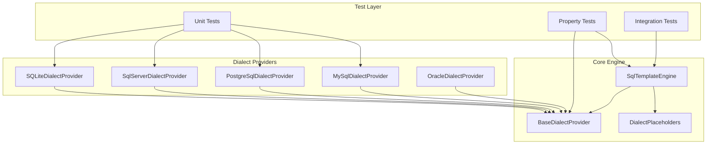

# Design Document: SQL Semantic TDD Validation

## Overview

本设计文档定义了对Sqlx项目中所有支持的数据库方言进行SQL语义TDD验证的架构和实现方案。目标是通过测试驱动开发(TDD)确保生成的SQL语句在各个数据库中语义正确，并在发现错误时进行修复。

支持的数据库方言：
- MySQL
- PostgreSQL  
- SQL Server
- SQLite
- Oracle

## Architecture

### 组件架构



### 测试分层策略

1. **单元测试层**: 测试各个DialectProvider的独立方法
2. **属性测试层**: 验证跨方言的通用属性和不变量
3. **集成测试层**: 验证SqlTemplateEngine与DialectProvider的协作

## Components and Interfaces

### IDatabaseDialectProvider 接口

```csharp
internal interface IDatabaseDialectProvider
{
    SqlDefine SqlDefine { get; }
    SqlDefineTypes DialectType { get; }
    
    // 分页
    string GenerateLimitClause(int? limit, int? offset);
    string GenerateLimitOffsetClause(string limitParam, string offsetParam, out bool requiresOrderBy);
    
    // INSERT操作
    string GenerateInsertWithReturning(string tableName, string[] columns);
    string GenerateBatchInsert(string tableName, string[] columns, int batchSize);
    
    // UPSERT操作
    string GenerateUpsert(string tableName, string[] columns, string[] keyColumns);
    
    // 类型映射
    string GetDatabaseTypeName(Type dotNetType);
    
    // 日期时间
    string FormatDateTime(DateTime dateTime);
    string GetCurrentDateTimeSyntax();
    
    // 字符串操作
    string GetConcatenationSyntax(params string[] expressions);
    
    // 布尔值
    string GetBoolTrueLiteral();
    string GetBoolFalseLiteral();
    
    // 占位符处理
    string ReplacePlaceholders(string sqlTemplate, string? tableName = null, string[]? columns = null);
    string GetReturningIdClause();
}
```

### SqlDefine 类

每个数据库方言的SQL定义，包含：
- `ParameterPrefix`: 参数前缀 (@, $, :)
- `WrapColumn()`: 标识符包裹方法
- `QuoteChar`: 引用字符

### SqlTemplateEngine 类

SQL模板处理引擎，负责：
- 解析和替换占位符
- 验证SQL安全性
- 生成数据库特定的SQL

## Data Models

### SqlTemplateResult

```csharp
public class SqlTemplateResult
{
    public string ProcessedSql { get; set; }
    public Dictionary<string, object?> Parameters { get; set; }
    public List<string> Warnings { get; set; }
    public List<string> Errors { get; set; }
    public bool HasDynamicFeatures { get; set; }
    public List<string> ColumnOrder { get; set; }
}
```

### 测试数据模型

```csharp
// 测试用实体
public class TestEntity
{
    public long Id { get; set; }
    public string Name { get; set; }
    public string Email { get; set; }
    public bool IsActive { get; set; }
    public DateTime CreatedAt { get; set; }
    public DateTime? UpdatedAt { get; set; }
    public decimal Price { get; set; }
    public Guid ExternalId { get; set; }
}

// 方言测试配置
public record DialectTestConfig(
    SqlDefine Dialect,
    string ExpectedIdentifierQuote,
    string ExpectedParameterPrefix,
    string ExpectedBoolTrue,
    string ExpectedBoolFalse,
    string ExpectedCurrentTimestamp
);
```

## Correctness Properties

*A property is a characteristic or behavior that should hold true across all valid executions of a system-essentially, a formal statement about what the system should do. Properties serve as the bridge between human-readable specifications and machine-verifiable correctness guarantees.*

### Property 1: Identifier Quoting Consistency
*For any* valid identifier name and *for any* database dialect, the WrapColumn method SHALL return the identifier wrapped with the dialect-specific quote characters (MySQL: backticks, PostgreSQL/Oracle: double quotes, SQL Server/SQLite: square brackets).
**Validates: Requirements 1.1, 1.2, 1.3, 1.4, 1.5**

### Property 2: Parameter Prefix Consistency
*For any* parameter name and *for any* database dialect, the generated SQL SHALL use the correct parameter prefix (MySQL/@, PostgreSQL/$or@, SQL Server/@, SQLite/@, Oracle/:).
**Validates: Requirements 2.1, 2.2, 2.3, 2.4, 2.5**

### Property 3: Pagination Syntax Correctness
*For any* valid limit and offset values and *for any* database dialect, GenerateLimitClause SHALL return syntactically correct pagination SQL for that dialect.
**Validates: Requirements 3.1, 3.2, 3.3, 3.4, 3.5**

### Property 4: MySQL OFFSET Requires LIMIT
*For any* offset value without a limit value in MySQL, GenerateLimitClause SHALL throw ArgumentException.
**Validates: Requirements 3.6**

### Property 5: INSERT Returning ID Syntax
*For any* table name and columns and *for any* database dialect, GenerateInsertWithReturning SHALL return syntactically correct INSERT statement with the dialect-specific ID returning mechanism.
**Validates: Requirements 4.1, 4.2, 4.3, 4.4, 4.5**

### Property 6: Upsert Syntax Correctness
*For any* table name, columns, and key columns and *for any* database dialect, GenerateUpsert SHALL return syntactically correct UPSERT statement using the dialect-specific syntax.
**Validates: Requirements 5.1, 5.2, 5.3, 5.4, 5.5**

### Property 7: Boolean Literal Correctness
*For any* database dialect, GetBoolTrueLiteral and GetBoolFalseLiteral SHALL return the correct boolean representation for that dialect.
**Validates: Requirements 6.1, 6.2, 6.3, 6.4, 6.5, 6.6, 6.7, 6.8**

### Property 8: Current DateTime Function Correctness
*For any* database dialect, GetCurrentDateTimeSyntax SHALL return the correct function name for getting current timestamp.
**Validates: Requirements 7.1, 7.2, 7.3, 7.4, 7.5**

### Property 9: String Concatenation Syntax
*For any* array of expressions and *for any* database dialect, GetConcatenationSyntax SHALL return the correct concatenation syntax (MySQL: CONCAT(), PostgreSQL/SQLite/Oracle: ||, SQL Server: +).
**Validates: Requirements 8.1, 8.2, 8.3, 8.4, 8.5**

### Property 10: String Concatenation Edge Cases
*For any* single expression, GetConcatenationSyntax SHALL return the expression unchanged. *For any* empty array, it SHALL return empty string.
**Validates: Requirements 8.6, 8.7**

### Property 11: Data Type Mapping Correctness
*For any* .NET type and *for any* database dialect, GetDatabaseTypeName SHALL return a valid database type name appropriate for that dialect.
**Validates: Requirements 9.1, 9.2, 9.3, 9.4, 9.5, 9.6, 9.7**

### Property 12: Batch INSERT Syntax
*For any* table name, columns, and batch size and *for any* database dialect, GenerateBatchInsert SHALL return syntactically correct multi-row INSERT statement.
**Validates: Requirements 10.1, 10.2, 10.3, 10.4, 10.5**

### Property 13: DateTime Formatting
*For any* DateTime value and *for any* database dialect, FormatDateTime SHALL return a properly formatted date string that the database can parse.
**Validates: Requirements 11.1, 11.2, 11.3, 11.4, 11.5**

### Property 14: LIMIT/OFFSET Clause with Parameters
*For any* limit and offset parameter names and *for any* database dialect, GenerateLimitOffsetClause SHALL return correct parameterized pagination clause and correctly set requiresOrderBy flag.
**Validates: Requirements 12.1, 12.2, 12.3, 12.4, 12.5**

### Property 15: Table Placeholder Processing
*For any* table name, the {{table}} placeholder SHALL be replaced with the snake_case converted table name, optionally wrapped with dialect-specific quotes.
**Validates: Requirements 17.1, 17.2, 17.3, 17.4, 17.5, 17.6**

### Property 16: Columns Placeholder Processing
*For any* entity type, the {{columns}} placeholder SHALL be replaced with comma-separated snake_case column names from entity properties.
**Validates: Requirements 18.1, 18.2, 18.3, 18.4, 18.5**

### Property 17: Columns Exclude/Only Options
*For any* entity type with {{columns --exclude col1 col2}}, the specified columns SHALL be excluded. *For any* {{columns --only col1 col2}}, only specified columns SHALL be included.
**Validates: Requirements 18.3, 18.4**

### Property 18: Values Placeholder Processing
*For any* entity type, the {{values}} placeholder SHALL generate parameter placeholders matching the columns in {{columns}}.
**Validates: Requirements 19.1, 19.2, 19.3, 19.4, 19.5, 19.6**

### Property 19: Set Placeholder Processing
*For any* entity type, the {{set}} placeholder SHALL generate column=@parameter pairs with proper exclusion support.
**Validates: Requirements 20.1, 20.2, 20.3, 20.4, 20.5**

### Property 20: OrderBy Placeholder Processing
*For any* column name and direction option, the {{orderby}} placeholder SHALL generate correct ORDER BY clause.
**Validates: Requirements 21.1, 21.2, 21.3, 21.4, 21.5**

### Property 21: Boolean Placeholder Processing
*For any* database dialect, {{bool_true}} and {{bool_false}} placeholders SHALL be replaced with correct boolean literals.
**Validates: Requirements 23.1, 23.2, 23.3, 23.4, 23.5, 23.6, 23.7, 23.8**

### Property 22: Current Timestamp Placeholder Processing
*For any* database dialect, {{current_timestamp}} placeholder SHALL be replaced with correct timestamp function.
**Validates: Requirements 24.1, 24.2, 24.3, 24.4, 24.5**

### Property 23: SQL Injection Prevention
*For any* dynamic placeholder input containing dangerous SQL keywords (DROP, DELETE, EXEC, --, /*), the validation SHALL reject the input.
**Validates: Requirements 36.1, 36.2, 36.3, 36.4, 36.5, 36.6**

### Property 24: Numeric Type Mapping
*For any* numeric .NET type (Int16, Int32, Int64, Single, Double, Decimal) and *for any* database dialect, GetDatabaseTypeName SHALL return appropriate numeric database type.
**Validates: Requirements 37.1, 37.2, 37.3, 37.4, 37.5, 37.6**

### Property 25: String Type Mapping
*For any* string .NET type and *for any* database dialect, GetDatabaseTypeName SHALL return appropriate string database type (VARCHAR, NVARCHAR, TEXT).
**Validates: Requirements 38.1, 38.2, 38.3, 38.4, 38.5**

### Property 26: DateTime Type Mapping
*For any* date/time .NET type (DateTime, DateTimeOffset, TimeSpan) and *for any* database dialect, GetDatabaseTypeName SHALL return appropriate temporal database type.
**Validates: Requirements 39.1, 39.2, 39.3, 39.4, 39.5**

### Property 27: Special Type Mapping
*For any* special .NET type (Guid, byte[], Boolean) and *for any* database dialect, GetDatabaseTypeName SHALL return appropriate database type.
**Validates: Requirements 40.1, 40.2, 40.3, 40.4, 40.5**

### Property 28: Aggregate Function Syntax
*For any* aggregate function (COUNT, SUM, AVG, MAX, MIN) and *for any* database dialect, the generated SQL SHALL be syntactically correct.
**Validates: Requirements 29.1, 29.2, 29.3, 29.4, 29.5, 29.6**

### Property 29: JOIN Syntax Correctness
*For any* JOIN type (INNER, LEFT, RIGHT, FULL) and *for any* database dialect that supports it, the generated SQL SHALL be syntactically correct.
**Validates: Requirements 28.1, 28.2, 28.3, 28.4, 28.5**

### Property 30: GROUP BY and HAVING Syntax
*For any* GROUP BY columns and HAVING conditions and *for any* database dialect, the generated SQL SHALL be syntactically correct.
**Validates: Requirements 30.1, 30.2, 30.3, 30.4**

### Property 31: CASE Expression Syntax
*For any* CASE expression type (simple, searched, nested) and *for any* database dialect, the generated SQL SHALL be syntactically correct.
**Validates: Requirements 46.1, 46.2, 46.3, 46.4, 46.5**

### Property 32: JSON Operation Syntax
*For any* JSON operation and *for any* database dialect that supports it, the generated SQL SHALL be syntactically correct (SQL Server: JSON_VALUE, PostgreSQL: jsonb operators, MySQL: JSON_EXTRACT, SQLite: json_extract).
**Validates: Requirements 49.1, 49.2, 49.3, 49.4, 49.5**

### Property 33: Full-Text Search Syntax
*For any* full-text search operation and *for any* database dialect that supports it, the generated SQL SHALL be syntactically correct (MySQL: MATCH AGAINST, PostgreSQL: to_tsvector/to_tsquery, SQL Server: CONTAINS/FREETEXT, SQLite: FTS5).
**Validates: Requirements 50.1, 50.2, 50.3, 50.4, 50.5**

### Property 34: Transaction Compatibility
*For any* generated SQL statement (INSERT, UPDATE, DELETE, UPSERT, batch operations), it SHALL be executable within a transaction without causing implicit commits or breaking transaction semantics.
**Validates: Requirements 44.1, 44.2, 44.3, 44.4**

## Error Handling

### 错误类型

1. **ArgumentException**: 无效输入参数
   - 空表名或列名
   - MySQL OFFSET without LIMIT
   - 无效的占位符选项

2. **InvalidOperationException**: 操作错误
   - 正则表达式超时 (ReDoS防护)
   - 不支持的数据库特性

3. **SqlInjectionException**: SQL注入检测
   - 动态占位符包含危险关键字
   - 注释标记检测

### 错误消息格式

```csharp
// 示例错误消息
"Invalid table name: '{tableName}'. Table name cannot be empty."
"MySQL requires LIMIT when OFFSET is specified."
"Invalid SQL fragment: '{fragment}'. Contains dangerous keywords."
"Regex pattern '{pattern}' caused timeout - possible ReDoS attack"
```

## Testing Strategy

### 测试框架选择

- **单元测试**: MSTest (项目已使用)
- **属性测试**: FsCheck.Xunit 或 Hedgehog (推荐FsCheck，.NET生态成熟)

### 测试分类

1. **TDD-Red**: 新功能测试（预期失败）
2. **TDD-Green**: 已实现功能测试（预期通过）
3. **Dialect**: 数据库方言特定测试
4. **MultiDialect**: 跨方言对比测试
5. **Security**: 安全性测试
6. **EdgeCase**: 边界条件测试

### 属性测试配置

```csharp
// FsCheck配置
public class SqlxPropertyConfig : PropertyAttribute
{
    public SqlxPropertyConfig()
    {
        MaxTest = 100;  // 最少100次迭代
        Arbitrary = new[] { typeof(SqlxArbitraries) };
    }
}

// 自定义生成器
public static class SqlxArbitraries
{
    public static Arbitrary<string> ValidIdentifier() =>
        Arb.Default.String()
            .Filter(s => !string.IsNullOrEmpty(s) && s.Length <= 128)
            .Generator
            .Select(s => Regex.Replace(s, @"[^a-zA-Z0-9_]", ""))
            .Where(s => s.Length > 0 && char.IsLetter(s[0]))
            .ToArbitrary();
            
    public static Arbitrary<SqlDefine> Dialect() =>
        Gen.Elements(
            SqlDefine.MySql,
            SqlDefine.PostgreSql,
            SqlDefine.SqlServer,
            SqlDefine.SQLite,
            SqlDefine.Oracle
        ).ToArbitrary();
}
```

### 测试命名约定

```
{Component}_{Scenario}_{ExpectedBehavior}
例如:
MySqlDialectProvider_GenerateLimitClause_WithLimitAndOffset_ShouldReturnLimitOffset
SqlTemplateEngine_ProcessTemplate_WithBoolTruePlaceholder_ShouldReturnDialectSpecificLiteral
```

### 测试覆盖目标

- 单元测试: 每个DialectProvider方法
- 属性测试: 每个Correctness Property
- 集成测试: 关键的端到端场景
- 边界测试: NULL、空值、极限值

### 测试文件组织

```
tests/Sqlx.Tests/
├── Dialects/
│   ├── MySqlDialectProviderTests.cs
│   ├── PostgreSqlDialectProviderTests.cs
│   ├── SqlServerDialectProviderTests.cs
│   ├── SQLiteDialectProviderTests.cs
│   ├── OracleDialectProviderTests.cs
│   ├── TDD_MultiDialect_Core.cs
│   └── PropertyTests/
│       ├── IdentifierQuotingPropertyTests.cs
│       ├── PaginationPropertyTests.cs
│       ├── TypeMappingPropertyTests.cs
│       └── SqlInjectionPropertyTests.cs
├── Placeholders/
│   ├── TablePlaceholderTests.cs
│   ├── ColumnsPlaceholderTests.cs
│   ├── ValuesPlaceholderTests.cs
│   └── SetPlaceholderTests.cs
└── Security/
    └── SqlInjectionPreventionTests.cs
```
