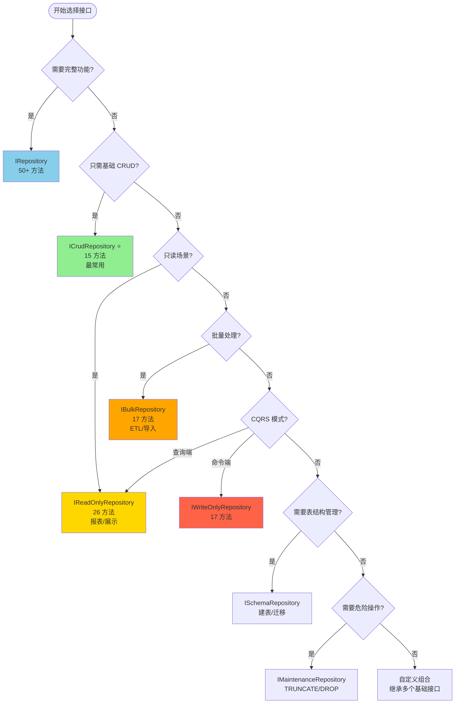

# Sqlx 预定义接口完整指南

## 简介

Sqlx 提供了一套完善的预定义 CRUD 接口，包含 **50+ 个常用方法**，让你无需手写任何方法定义即可获得完整的数据库操作能力。只需 3 行代码，即可拥有增删改查、批量操作、聚合统计、事务处理等全部功能。

### 为什么使用预定义接口？

**传统方式**（手写方法）：
```csharp
public partial interface IUserRepository
{
    [SqlTemplate("SELECT {{columns}} FROM {{table}} WHERE id = @id")]
    Task<User?> GetByIdAsync(long id);
    
    [SqlTemplate("SELECT {{columns}} FROM {{table}}")]
    Task<List<User>> GetAllAsync();
    
    [SqlTemplate("INSERT INTO {{table}} ({{columns --exclude Id}}) VALUES ({{values --exclude Id}})")]
    [ReturnInsertedId]
    Task<long> InsertAndGetIdAsync(User user);
    
    // ... 需要手写 50+ 个方法
}
```

**预定义接口方式**（推荐）：
```csharp
[RepositoryFor(typeof(ICrudRepository<User, long>))]
public partial class UserRepository(DbConnection conn) 
    : ICrudRepository<User, long> { }
```

✅ **3 行代码 = 15+ 个方法**  
✅ **无需手写 SQL 模板**  
✅ **类型安全，编译时检查**  
✅ **跨数据库兼容**  
✅ **性能等同手写方法**

---

## 接口层次结构

Sqlx 预定义接口采用组合式设计，你可以根据需求选择合适的接口：

```
IRepository<TEntity, TKey>  (完整功能 - 50+ 方法)
├─ IQueryRepository<TEntity, TKey>       (查询 - 11 方法)
├─ ICommandRepository<TEntity, TKey>     (命令 - 11 方法)
├─ IBatchRepository<TEntity, TKey>       (批量 - 6 方法)
├─ IAggregateRepository<TEntity, TKey>   (聚合 - 15 方法)
└─ IAdvancedRepository<TEntity, TKey>    (高级 - 8 方法)

ICrudRepository<TEntity, TKey>  (基础 CRUD - 15 方法)
├─ IQueryRepository<TEntity, TKey>
├─ ICommandRepository<TEntity, TKey>
└─ IAggregateRepository<TEntity, TKey> (只包含 CountAsync)

IReadOnlyRepository<TEntity, TKey>  (只读 - 26 方法)
├─ IQueryRepository<TEntity, TKey>
└─ IAggregateRepository<TEntity, TKey>

IBulkRepository<TEntity, TKey>  (批量 - 17 方法)
├─ IQueryRepository<TEntity, TKey>
└─ IBatchRepository<TEntity, TKey>

IWriteOnlyRepository<TEntity, TKey>  (只写 - 17 方法)
├─ ICommandRepository<TEntity, TKey>
└─ IBatchRepository<TEntity, TKey>
```

### 基础接口（Building Blocks）

这些接口是构建其他接口的基础模块：

| 接口 | 方法数 | 用途 | 典型场景 |
|------|--------|------|----------|
| `IQueryRepository<TEntity, TKey>` | 11 | 查询操作 | 数据读取、条件查询、分页 |
| `ICommandRepository<TEntity, TKey>` | 11 | 命令操作 | 增删改、软删除、Upsert |
| `IBatchRepository<TEntity, TKey>` | 6 | 批量操作 | 批量插入/更新/删除 |
| `IAggregateRepository<TEntity, TKey>` | 15 | 聚合统计 | COUNT、SUM、AVG、MAX、MIN |
| `IAdvancedRepository<TEntity, TKey>` | 8 | 高级功能 | 原始 SQL、事务、批量导入 |

### 组合接口（Composite Interfaces）

这些接口组合了多个基础接口，提供特定场景的完整功能：

| 接口 | 继承自 | 方法数 | 推荐场景 |
|------|--------|--------|----------|
| `ICrudRepository<TEntity, TKey>` | IQuery + ICommand + Count | 15 | **最常用**，标准 CRUD 场景 |
| `IRepository<TEntity, TKey>` | 所有基础接口 | 50+ | 需要完整功能的场景 |
| `IReadOnlyRepository<TEntity, TKey>` | IQuery + IAggregate | 26 | 只读场景、报表、CQRS 查询端 |
| `IBulkRepository<TEntity, TKey>` | IQuery + IBatch | 17 | 批量数据处理、ETL |
| `IWriteOnlyRepository<TEntity, TKey>` | ICommand + IBatch | 17 | CQRS 命令端、数据导入 |

### 特殊接口

| 接口 | 用途 | 注意事项 |
|------|------|----------|
| `ISchemaRepository<TEntity>` | 表结构管理 | 用于迁移、建表、结构检查 |
| `IMaintenanceRepository<TEntity>` | 危险操作 | ⚠️ TRUNCATE、DROP TABLE 等 |
| `IPartialUpdateRepository<TEntity, TKey, TUpdates>` | AOT 兼容部分更新 | 接口级泛型，编译时生成 |
| `IExpressionUpdateRepository<TEntity, TKey>` | 表达式树部分更新 | 灵活指定更新字段 |

---

## 接口选择决策树

### 快速选择指南

```
开始
 │
 ├─ 需要完整功能？
 │   └─ 是 → IRepository<TEntity, TKey>
 │
 ├─ 只需要基础 CRUD？
 │   └─ 是 → ICrudRepository<TEntity, TKey> ⭐ 推荐
 │
 ├─ 只读场景（报表、展示）？
 │   └─ 是 → IReadOnlyRepository<TEntity, TKey>
 │
 ├─ 批量数据处理（ETL、导入）？
 │   └─ 是 → IBulkRepository<TEntity, TKey>
 │
 ├─ CQRS 模式？
 │   ├─ 查询端 → IReadOnlyRepository<TEntity, TKey>
 │   └─ 命令端 → IWriteOnlyRepository<TEntity, TKey>
 │
 └─ 自定义组合？
     └─ 继承多个基础接口

```

### 可视化决策流程图



### 详细对比表

| 场景 | 推荐接口 | 方法数 | 包含功能 | 理由 |
|------|----------|--------|----------|------|
| Web API CRUD | `ICrudRepository` | 15 | 查询 + 命令 + Count | 包含常用的增删改查，最常用 ⭐ |
| 管理后台 | `IRepository` | 50+ | 全部功能 | 需要完整功能（批量、聚合、高级） |
| 移动端 API | `IReadOnlyRepository` | 26 | 查询 + 聚合 | 大多数场景只需读取数据 |
| 数据导入工具 | `IBulkRepository` | 17 | 查询 + 批量 | 高性能批量操作（10-50x 提升） |
| 报表系统 | `IReadOnlyRepository` | 26 | 查询 + 聚合 | 只读 + 统计分析 |
| 数据分析 | `IReadOnlyRepository` | 26 | 查询 + 聚合 | SUM、AVG、MAX、MIN、COUNT |
| 微服务（CQRS 查询） | `IReadOnlyRepository` | 26 | 查询 + 聚合 | 读写分离 - 查询端 |
| 微服务（CQRS 命令） | `IWriteOnlyRepository` | 17 | 命令 + 批量 | 读写分离 - 命令端 |
| ETL 流程 | `IBulkRepository` | 17 | 查询 + 批量 | 数据抽取、转换、加载 |
| 数据迁移 | `IBulkRepository` | 17 | 查询 + 批量 | 批量读取和写入 |
| 测试数据清理 | `IMaintenanceRepository` | 7 | 危险操作 | TRUNCATE、DROP TABLE |
| 数据库初始化 | `ISchemaRepository` | 6 | 表结构管理 | 建表、检查表存在 |

### 功能需求对照表

| 需求 | ICrud | IRepository | IReadOnly | IBulk | IWriteOnly |
|------|-------|-------------|-----------|-------|------------|
| 单条查询 | ✅ | ✅ | ✅ | ✅ | ❌ |
| 批量查询 | ✅ | ✅ | ✅ | ✅ | ❌ |
| 分页查询 | ✅ | ✅ | ✅ | ✅ | ❌ |
| 条件查询 | ✅ | ✅ | ✅ | ✅ | ❌ |
| 插入操作 | ✅ | ✅ | ❌ | ❌ | ✅ |
| 更新操作 | ✅ | ✅ | ❌ | ❌ | ✅ |
| 删除操作 | ✅ | ✅ | ❌ | ❌ | ✅ |
| 批量插入 | ❌ | ✅ | ❌ | ✅ | ✅ |
| 批量更新 | ❌ | ✅ | ❌ | ✅ | ✅ |
| 批量删除 | ❌ | ✅ | ❌ | ✅ | ✅ |
| 统计计数 | ✅ | ✅ | ✅ | ❌ | ❌ |
| 聚合函数 | ❌ | ✅ | ✅ | ❌ | ❌ |
| 原始 SQL | ❌ | ✅ | ❌ | ❌ | ❌ |
| 事务控制 | ❌ | ✅ | ❌ | ❌ | ❌ |
| 批量导入 | ❌ | ✅ | ❌ | ❌ | ❌ |

---

## 1. ICrudRepository - 基础 CRUD 接口

### 概述

`ICrudRepository<TEntity, TKey>` 是**最常用**的预定义接口，包含标准 CRUD 操作的所有方法（15 个）。

### 继承关系

```csharp
ICrudRepository<TEntity, TKey> : 
    IQueryRepository<TEntity, TKey>,      // 11 个查询方法
    ICommandRepository<TEntity, TKey>     // 11 个命令方法
    // + CountAsync (聚合方法)
```

### 使用示例

```csharp
// 1. 定义实体
public class User
{
    public long Id { get; set; }
    public string Name { get; set; }
    public int Age { get; set; }
    public bool IsActive { get; set; }
}

// 2. 定义仓储（3 行代码）
[RepositoryFor(typeof(ICrudRepository<User, long>))]
public partial class UserRepository(DbConnection conn) 
    : ICrudRepository<User, long> { }

// 3. 使用（自动拥有 15+ 个方法）
var repo = new UserRepository(connection);

// 查询
var user = await repo.GetByIdAsync(1);
var users = await repo.GetAllAsync(limit: 100);
var activeUsers = await repo.GetWhereAsync(x => x.IsActive);
var page = await repo.GetPageAsync(pageNumber: 1, pageSize: 20);

// 插入
var newUser = new User { Name = "Alice", Age = 25 };
var id = await repo.InsertAndGetIdAsync(newUser);

// 更新
user.Age = 26;
await repo.UpdateAsync(user);

// 删除
await repo.DeleteAsync(id);

// 统计
var count = await repo.CountAsync();
```

### 完整方法列表

#### 查询方法（来自 IQueryRepository）

| 方法 | 返回类型 | 说明 |
|------|----------|------|
| `GetByIdAsync(id)` | `Task<TEntity?>` | 根据主键查询单个实体 |
| `GetByIdsAsync(ids)` | `Task<List<TEntity>>` | 根据主键列表批量查询 |
| `GetAllAsync(limit, orderBy)` | `Task<List<TEntity>>` | 查询所有实体（带限制） |
| `GetTopAsync(limit, orderBy)` | `Task<List<TEntity>>` | 查询前 N 条 |
| `GetRangeAsync(limit, offset, orderBy)` | `Task<List<TEntity>>` | 分页查询（offset/limit） |
| `GetPageAsync(pageNumber, pageSize, orderBy)` | `Task<PagedResult<TEntity>>` | 分页查询（带总数） |
| `GetWhereAsync(predicate)` | `Task<List<TEntity>>` | 条件查询（表达式） |
| `GetFirstWhereAsync(predicate)` | `Task<TEntity?>` | 查询第一个匹配项 |
| `ExistsAsync(id)` | `Task<bool>` | 检查主键是否存在 |
| `ExistsWhereAsync(predicate)` | `Task<bool>` | 检查条件是否匹配 |
| `GetRandomAsync(count)` | `Task<List<TEntity>>` | 随机查询 N 条 |

#### 命令方法（来自 ICommandRepository）

| 方法 | 返回类型 | 说明 |
|------|----------|------|
| `InsertAsync(entity)` | `Task<int>` | 插入实体 |
| `InsertAndGetIdAsync(entity)` | `Task<TKey>` | 插入并返回主键 |
| `InsertAndGetEntityAsync(entity)` | `Task<TEntity>` | 插入并返回完整实体 |
| `UpdateAsync(entity)` | `Task<int>` | 更新实体 |
| `UpdatePartialAsync(id, updates)` | `Task<int>` | 部分更新 |
| `UpdateWhereAsync(predicate, updates)` | `Task<int>` | 条件更新 |
| `UpsertAsync(entity)` | `Task<int>` | 插入或更新 |
| `DeleteAsync(id)` | `Task<int>` | 物理删除 |
| `DeleteWhereAsync(predicate)` | `Task<int>` | 条件删除 |
| `SoftDeleteAsync(id)` | `Task<int>` | 软删除 |
| `RestoreAsync(id)` | `Task<int>` | 恢复软删除 |
| `PurgeDeletedAsync()` | `Task<int>` | 清理软删除数据 |

#### 聚合方法

| 方法 | 返回类型 | 说明 |
|------|----------|------|
| `CountAsync()` | `Task<long>` | 统计总数 |

---

## 2. IRepository - 完整功能接口

### 概述

`IRepository<TEntity, TKey>` 包含**所有预定义方法（50+ 个）**，适合需要完整功能的场景。

### 继承关系

```csharp
IRepository<TEntity, TKey> : 
    IQueryRepository<TEntity, TKey>,      // 11 个查询方法
    ICommandRepository<TEntity, TKey>,    // 11 个命令方法
    IBatchRepository<TEntity, TKey>,      // 6 个批量方法
    IAggregateRepository<TEntity, TKey>,  // 15 个聚合方法
    IAdvancedRepository<TEntity, TKey>    // 8 个高级方法
```


### 使用示例

```csharp
[RepositoryFor(typeof(IRepository<User, long>))]
public partial class UserRepository(DbConnection conn) 
    : IRepository<User, long> { }

var repo = new UserRepository(connection);

// 批量操作
var users = new List<User> { /* ... */ };
await repo.BatchInsertAsync(users);
await repo.BatchUpdateAsync(users);
await repo.BatchDeleteAsync(new List<long> { 1, 2, 3 });

// 聚合统计
var count = await repo.CountAsync();
var avgAge = await repo.AvgAsync("age");
var maxAge = await repo.MaxIntAsync("age");
var totalSalary = await repo.SumAsync("salary");

// 高级功能
await repo.BeginTransactionAsync();
try
{
    await repo.InsertAsync(user1);
    await repo.InsertAsync(user2);
    await repo.CommitTransactionAsync();
}
catch
{
    await repo.RollbackTransactionAsync();
}

// 原始 SQL
var result = await repo.QueryRawAsync<UserDto>(
    "SELECT u.*, COUNT(o.id) as OrderCount FROM users u LEFT JOIN orders o ON u.id = o.user_id GROUP BY u.id"
);
```

### 额外方法（相比 ICrudRepository）

#### 批量方法（来自 IBatchRepository）

| 方法 | 说明 |
|------|------|
| `BatchInsertAsync(entities)` | 批量插入（10-50x 性能提升） |
| `BatchUpdateAsync(entities)` | 批量更新 |
| `BatchUpdateWhereAsync(predicate, updates)` | 条件批量更新 |
| `BatchDeleteAsync(ids)` | 批量删除 |
| `BatchSoftDeleteAsync(ids)` | 批量软删除 |
| `BatchUpsertAsync(entities)` | 批量 Upsert |
| `BatchExistsAsync(ids)` | 批量检查存在 |

#### 聚合方法（来自 IAggregateRepository）

| 方法 | 说明 |
|------|------|
| `CountWhereAsync(predicate)` | 条件统计 |
| `CountByAsync(column)` | 分组统计 |
| `SumAsync(column)` | 求和 |
| `SumWhereAsync(column, predicate)` | 条件求和 |
| `AvgAsync(column)` | 平均值 |
| `AvgWhereAsync(column, predicate)` | 条件平均值 |
| `MaxIntAsync(column)` / `MaxLongAsync` / `MaxDecimalAsync` / `MaxDateTimeAsync` | 最大值 |
| `MinIntAsync(column)` / `MinLongAsync` / `MinDecimalAsync` / `MinDateTimeAsync` | 最小值 |

#### 高级方法（来自 IAdvancedRepository）

| 方法 | 说明 |
|------|------|
| `ExecuteRawAsync(sql, parameters)` | 执行原始 SQL 命令 |
| `QueryRawAsync(sql, parameters)` | 查询返回实体 |
| `QueryRawAsync<T>(sql, parameters)` | 查询返回自定义类型 |
| `ExecuteScalarAsync<T>(sql, parameters)` | 查询标量值 |
| `BulkCopyAsync(entities)` | 批量导入（100-1000x 性能） |
| `BeginTransactionAsync()` | 开始事务 |
| `CommitTransactionAsync()` | 提交事务 |
| `RollbackTransactionAsync()` | 回滚事务 |

---

## 3. IReadOnlyRepository - 只读接口

### 概述

`IReadOnlyRepository<TEntity, TKey>` 适合只读场景，包含查询和聚合方法（26 个），不包含任何修改操作。

### 继承关系

```csharp
IReadOnlyRepository<TEntity, TKey> : 
    IQueryRepository<TEntity, TKey>,      // 11 个查询方法
    IAggregateRepository<TEntity, TKey>   // 15 个聚合方法
```

### 使用场景

- 📊 报表系统
- 📱 移动端 API（大多数场景只读）
- 🔍 搜索服务
- 📈 数据分析
- 🔐 只读数据库副本
- 🎯 CQRS 查询端

### 使用示例

```csharp
[RepositoryFor(typeof(IReadOnlyRepository<User, long>))]
public partial class UserQueryRepository(DbConnection conn) 
    : IReadOnlyRepository<User, long> { }

var repo = new UserQueryRepository(readOnlyConnection);

// 查询
var users = await repo.GetAllAsync();
var activeUsers = await repo.GetWhereAsync(x => x.IsActive);

// 统计
var totalUsers = await repo.CountAsync();
var avgAge = await repo.AvgAsync("age");
var usersByStatus = await repo.CountByAsync("status");

// ❌ 没有修改方法
// repo.InsertAsync(user);  // 编译错误
// repo.UpdateAsync(user);  // 编译错误
// repo.DeleteAsync(id);    // 编译错误
```

---

## 4. IBulkRepository - 批量操作接口

### 概述

`IBulkRepository<TEntity, TKey>` 专注于高性能批量数据处理（17 个方法）。

### 继承关系

```csharp
IBulkRepository<TEntity, TKey> : 
    IQueryRepository<TEntity, TKey>,   // 11 个查询方法
    IBatchRepository<TEntity, TKey>    // 6 个批量方法
```

### 使用场景

- 📥 数据导入
- 📤 数据导出
- 🔄 ETL 流程
- 🗄️ 数据迁移
- 🧹 批量清理

### 使用示例

```csharp
[RepositoryFor(typeof(IBulkRepository<User, long>))]
public partial class UserBulkRepository(DbConnection conn) 
    : IBulkRepository<User, long> { }

var repo = new UserBulkRepository(connection);

// 批量插入（10-50x 性能提升）
var users = GenerateUsers(10000);
await repo.BatchInsertAsync(users);

// 批量更新
users.ForEach(u => u.IsActive = true);
await repo.BatchUpdateAsync(users);

// 批量删除
var idsToDelete = users.Select(u => u.Id).ToList();
await repo.BatchDeleteAsync(idsToDelete);
```

---

## 5. IWriteOnlyRepository - 只写接口

### 概述

`IWriteOnlyRepository<TEntity, TKey>` 适合 CQRS 命令端，只包含修改操作（17 个方法）。

### 继承关系

```csharp
IWriteOnlyRepository<TEntity, TKey> : 
    ICommandRepository<TEntity, TKey>,  // 11 个命令方法
    IBatchRepository<TEntity, TKey>     // 6 个批量方法
```

### 使用场景

- 🎯 CQRS 命令端
- 📝 数据写入服务
- 📥 数据导入 API

### 使用示例

```csharp
[RepositoryFor(typeof(IWriteOnlyRepository<User, long>))]
public partial class UserCommandRepository(DbConnection conn) 
    : IWriteOnlyRepository<User, long> { }

var repo = new UserCommandRepository(connection);

// 单个操作
await repo.InsertAsync(user);
await repo.UpdateAsync(user);
await repo.DeleteAsync(id);

// 批量操作
await repo.BatchInsertAsync(users);
await repo.BatchUpdateAsync(users);

// ❌ 没有查询方法
// var user = await repo.GetByIdAsync(1);  // 编译错误
```

---

## 6. 基础接口详解

### 6.1 IQueryRepository - 查询接口

包含所有查询相关方法（11 个）。

#### 单实体查询

```csharp
// 根据主键查询
var user = await repo.GetByIdAsync(1);

// 批量主键查询
var users = await repo.GetByIdsAsync(new List<long> { 1, 2, 3 });
```

#### 列表查询

```csharp
// 查询所有（带限制）
var users = await repo.GetAllAsync(limit: 1000, orderBy: "created_at DESC");

// 查询前 N 条
var topUsers = await repo.GetTopAsync(10, orderBy: "score DESC");

// 分页查询（offset/limit）
var users = await repo.GetRangeAsync(limit: 20, offset: 40, orderBy: "name ASC");

// 分页查询（带总数）
var page = await repo.GetPageAsync(pageNumber: 2, pageSize: 20, orderBy: "id DESC");
Console.WriteLine($"Total: {page.TotalCount}, Page: {page.PageNumber}/{page.TotalPages}");
```

#### 条件查询

```csharp
// 表达式查询
var activeUsers = await repo.GetWhereAsync(x => x.IsActive && x.Age >= 18);

// 查询第一个匹配项
var admin = await repo.GetFirstWhereAsync(x => x.Role == "Admin");
```

#### 存在性检查

```csharp
// 检查主键是否存在
bool exists = await repo.ExistsAsync(1);

// 检查条件是否匹配
bool hasAdmin = await repo.ExistsWhereAsync(x => x.Role == "Admin");
```

#### 其他查询

```csharp
// 随机查询
var randomUsers = await repo.GetRandomAsync(5);
```

---

### 6.2 ICommandRepository - 命令接口

包含所有修改操作方法（11 个）。

#### 插入操作

```csharp
// 插入实体
var user = new User { Name = "Alice", Age = 25 };
int affected = await repo.InsertAsync(user);

// 插入并返回主键
long id = await repo.InsertAndGetIdAsync(user);

// 插入并返回完整实体（包含生成的 ID）
User inserted = await repo.InsertAndGetEntityAsync(user);
```

#### 更新操作

```csharp
// 更新整个实体
user.Age = 26;
await repo.UpdateAsync(user);

// 部分更新（只更新指定字段）
await repo.UpdatePartialAsync(userId, new { Age = 27, UpdatedAt = DateTime.Now });

// 条件更新
await repo.UpdateWhereAsync(
    x => x.Status == "Pending" && x.CreatedAt < DateTime.Now.AddDays(-7),
    new { Status = "Expired" }
);

// Upsert（插入或更新）
await repo.UpsertAsync(user);
```

#### 删除操作

```csharp
// 物理删除
await repo.DeleteAsync(userId);

// 条件删除
await repo.DeleteWhereAsync(x => x.CreatedAt < DateTime.Now.AddYears(-1));
```

#### 软删除操作

```csharp
// 软删除（需要实体有 IsDeleted 和 DeletedAt 字段）
await repo.SoftDeleteAsync(userId);

// 恢复软删除
await repo.RestoreAsync(userId);

// 清理所有软删除数据（物理删除）
await repo.PurgeDeletedAsync();
```

---

### 6.3 IBatchRepository - 批量接口

包含高性能批量操作方法（6 个）。

#### 批量插入

```csharp
var users = new List<User>
{
    new User { Name = "Alice", Age = 25 },
    new User { Name = "Bob", Age = 30 },
    // ... 1000+ 条
};

// 批量插入（10-50x 性能提升）
int inserted = await repo.BatchInsertAsync(users);

// 批量插入并返回所有生成的 ID
List<long> ids = await repo.BatchInsertAndGetIdsAsync(users);
// ids 顺序与输入实体一致
```

#### 批量更新

```csharp
// 批量更新实体
users.ForEach(u => u.IsActive = true);
await repo.BatchUpdateAsync(users);

// 条件批量更新
await repo.BatchUpdateWhereAsync(
    x => x.Status == "Pending",
    new { Status = "Active", UpdatedAt = DateTime.Now }
);
```

#### 批量删除

```csharp
// 批量删除
var idsToDelete = new List<long> { 1, 2, 3, 4, 5 };
await repo.BatchDeleteAsync(idsToDelete);

// 批量软删除
await repo.BatchSoftDeleteAsync(idsToDelete);
```


#### 批量 Upsert

```csharp
// 批量插入或更新
await repo.BatchUpsertAsync(users);
```

#### 批量检查

```csharp
// 批量检查存在性
var ids = new List<long> { 1, 2, 999 };
var exists = await repo.BatchExistsAsync(ids);
// [true, true, false]
```

---

### 6.4 IAggregateRepository - 聚合接口

包含统计和聚合方法（15 个）。

#### 计数操作

```csharp
// 总数统计
long total = await repo.CountAsync();

// 条件统计
long activeCount = await repo.CountWhereAsync(x => x.IsActive);

// 分组统计
var countByStatus = await repo.CountByAsync("status");
// { "active": 100, "inactive": 50, "banned": 10 }
```

#### 求和操作

```csharp
// 求和
decimal totalSalary = await repo.SumAsync("salary");

// 条件求和
decimal paidTotal = await repo.SumWhereAsync("amount", x => x.Status == "Paid");
```

#### 平均值操作

```csharp
// 平均值
decimal avgAge = await repo.AvgAsync("age");

// 条件平均值
decimal avgSalary = await repo.AvgWhereAsync("salary", x => x.Department == "IT");
```

#### 最大值/最小值操作

```csharp
// 最大值（支持 int, long, decimal, DateTime）
int maxAge = await repo.MaxIntAsync("age");
long maxId = await repo.MaxLongAsync("id");
decimal maxPrice = await repo.MaxDecimalAsync("price");
DateTime latestDate = await repo.MaxDateTimeAsync("created_at");

// 最小值
int minAge = await repo.MinIntAsync("age");
decimal minPrice = await repo.MinDecimalAsync("price");
```

---

### 6.5 IAdvancedRepository - 高级接口

包含高级功能方法（8 个）。

#### 原始 SQL 执行

```csharp
// 执行命令（INSERT/UPDATE/DELETE）
int affected = await repo.ExecuteRawAsync(
    "UPDATE users SET status = @status WHERE age > @age",
    new { status = 1, age = 18 }
);

// 查询返回实体
var users = await repo.QueryRawAsync(
    "SELECT * FROM users WHERE name LIKE @pattern",
    new { pattern = "%Alice%" }
);

// 查询返回自定义类型
var dtos = await repo.QueryRawAsync<UserDto>(
    "SELECT u.id, u.name, COUNT(o.id) as OrderCount FROM users u LEFT JOIN orders o ON u.id = o.user_id GROUP BY u.id, u.name"
);

// 查询标量值
int maxId = await repo.ExecuteScalarAsync<int>("SELECT MAX(id) FROM users");
```

#### 批量导入

```csharp
// 批量导入（100-1000x 性能提升）
// 使用数据库特定的批量导入功能
var users = GenerateMillionUsers();
await repo.BulkCopyAsync(users);
```


#### 事务操作

```csharp
// 手动事务控制
await repo.BeginTransactionAsync();
try
{
    await repo.InsertAsync(user1);
    await repo.InsertAsync(user2);
    await repo.UpdateAsync(user3);
    await repo.CommitTransactionAsync();
}
catch (Exception ex)
{
    await repo.RollbackTransactionAsync();
    throw;
}
```

---

## 7. 特殊接口

### 7.1 ISchemaRepository - 表结构管理

用于数据库表结构操作，通常在迁移或初始化时使用。

```csharp
[RepositoryFor(typeof(ISchemaRepository<User>))]
public partial class UserSchemaRepository(DbConnection conn) 
    : ISchemaRepository<User> { }

var repo = new UserSchemaRepository(connection);

// 检查表是否存在
bool exists = await repo.TableExistsAsync();

// 生成建表 SQL
string ddl = await repo.GenerateCreateTableSqlAsync();
Console.WriteLine(ddl);
// CREATE TABLE users (
//   id INTEGER PRIMARY KEY AUTOINCREMENT,
//   name TEXT NOT NULL,
//   ...
// );

// 创建表（如果不存在）
await repo.CreateTableIfNotExistsAsync();

// 获取列名
var columns = await repo.GetColumnNamesAsync();

// 获取表大小
long rowCount = await repo.GetApproximateRowCountAsync();
long sizeBytes = await repo.GetTableSizeBytesAsync();
```

---

### 7.2 IMaintenanceRepository - 维护操作

⚠️ **警告：此接口包含危险操作，可能导致永久数据丢失！**

```csharp
[RepositoryFor(typeof(IMaintenanceRepository<User>))]
public partial class UserMaintenanceRepository(DbConnection conn) 
    : IMaintenanceRepository<User> { }

var repo = new UserMaintenanceRepository(connection);

// ⚠️ 清空表（删除所有数据，重置自增）
await repo.TruncateAsync();

// ⚠️ 删除所有行（可回滚）
int deleted = await repo.DeleteAllAsync();

// ⚠️ 删除表（永久删除表结构和数据）
await repo.DropTableAsync();

// 维护操作
await repo.RebuildIndexesAsync();      // 重建索引
await repo.UpdateStatisticsAsync();    // 更新统计信息
long reclaimed = await repo.ShrinkTableAsync();  // 收缩表空间
```

**使用建议**：
1. 仅在管理工具中使用
2. 需要特殊权限
3. 记录所有操作日志
4. 操作前备份数据
5. 需要用户确认

---

## 7.3 AOT 兼容的部分更新接口

### 背景

`ICommandRepository.UpdatePartialAsync<TUpdates>` 和 `IBatchRepository.BatchUpdateWhereAsync<TUpdates>` 使用方法级泛型参数，源代码生成器无法在编译时分析具体类型。为了实现完全的 AOT 兼容性，Sqlx 提供了两个专门的接口。

### IPartialUpdateRepository - 接口级泛型部分更新

使用接口级泛型参数，源代码生成器可以在编译时解析具体类型并生成直接属性访问代码。

```csharp
// 1. 定义更新类型
public record UserNameUpdate(string Name, DateTime UpdatedAt);

// 2. 实现接口（TUpdates 在接口级别指定）
[RepositoryFor(typeof(IPartialUpdateRepository<User, long, UserNameUpdate>))]
public partial class UserRepository(DbConnection conn) 
    : IPartialUpdateRepository<User, long, UserNameUpdate> { }

// 3. 使用
var repo = new UserRepository(connection);
await repo.UpdatePartialAsync(userId, new UserNameUpdate("Alice", DateTime.Now));
// 生成的 SQL: UPDATE users SET name = @Name, updated_at = @UpdatedAt WHERE id = @id
// 生成的代码直接访问属性: updates.Name, updates.UpdatedAt（无反射）
```

**方法列表**：

| 方法 | 说明 |
|------|------|
| `UpdatePartialAsync(id, updates)` | 根据主键部分更新 |
| `UpdateWhereAsync(predicate, updates)` | 条件部分更新 |

**优势**：
- ✅ 完全 AOT 兼容
- ✅ 编译时类型检查
- ✅ 无运行时反射
- ✅ 支持 record 和 class 类型

### IExpressionUpdateRepository - 表达式树部分更新

使用表达式树指定要更新的属性，无需定义额外的更新类型。

```csharp
// 1. 实现接口
[RepositoryFor(typeof(IExpressionUpdateRepository<User, long>))]
public partial class UserRepository(DbConnection conn) 
    : IExpressionUpdateRepository<User, long> { }

// 2. 使用表达式指定更新
var repo = new UserRepository(connection);
await repo.UpdateFieldsAsync(userId, u => new User { Name = "Alice", Age = 30 });
// 生成的 SQL: UPDATE users SET name = @__expr_p0, age = @__expr_p1 WHERE id = @id
```

**方法列表**：

| 方法 | 说明 |
|------|------|
| `UpdateFieldsAsync(id, updateExpression)` | 根据主键更新表达式指定的字段 |
| `UpdateFieldsWhereAsync(predicate, updateExpression)` | 条件更新表达式指定的字段 |

**优势**：
- ✅ AOT 兼容（表达式在运行时分析）
- ✅ 无需定义额外类型
- ✅ 灵活指定更新字段
- ✅ 类型安全

### 选择建议

| 场景 | 推荐接口 | 理由 |
|------|----------|------|
| 固定的更新字段组合 | `IPartialUpdateRepository` | 编译时生成，性能最优 |
| 动态更新字段 | `IExpressionUpdateRepository` | 灵活指定更新内容 |
| AOT 发布（NativeAOT） | 两者皆可 | 都不使用运行时反射 |
| 简单场景 | `IExpressionUpdateRepository` | 无需定义额外类型 |

### 与 ICommandRepository.UpdatePartialAsync 的对比

```csharp
// ❌ ICommandRepository.UpdatePartialAsync<TUpdates> - 方法级泛型，AOT 不兼容
// 源代码生成器无法在编译时知道 TUpdates 的具体类型
await repo.UpdatePartialAsync(id, new { Name = "Alice" });
// 编译时会生成 #error 提示使用新接口

// ✅ IPartialUpdateRepository<TEntity, TKey, TUpdates> - 接口级泛型，AOT 兼容
// 源代码生成器在编译时知道 TUpdates = UserNameUpdate
await repo.UpdatePartialAsync(id, new UserNameUpdate("Alice", DateTime.Now));

// ✅ IExpressionUpdateRepository<TEntity, TKey> - 表达式树，AOT 兼容
// 表达式在运行时分析，但不使用 GetType().GetProperties() 反射
await repo.UpdateFieldsAsync(id, u => new User { Name = "Alice" });
```

---

## 8. 数据库兼容性矩阵

### 8.1 核心功能兼容性

| 功能 | SQLite | PostgreSQL | MySQL | SQL Server | 说明 |
|------|--------|------------|-------|------------|------|
| 基础 CRUD | ✅ | ✅ | ✅ | ✅ | 所有数据库完全支持 |
| 批量操作 | ✅ | ✅ | ✅ | ✅ | 性能因数据库而异 |
| 聚合函数 | ✅ | ✅ | ✅ | ✅ | COUNT、SUM、AVG、MAX、MIN |
| 分页查询 | ✅ | ✅ | ✅ | ✅ | LIMIT/OFFSET 语法自动转换 |
| 事务支持 | ✅ | ✅ | ✅ | ✅ | ACID 事务 |
| 表达式查询 | ✅ | ✅ | ✅ | ✅ | Lambda 表达式转 SQL |
| 软删除 | ✅ | ✅ | ✅ | ✅ | 需要 IsDeleted 字段 |


### 8.2 高级功能兼容性

| 功能 | SQLite | PostgreSQL | MySQL | SQL Server | 实现方式 |
|------|--------|------------|-------|------------|----------|
| UPSERT | ✅ | ✅ | ✅ | ✅ | 数据库特定语法 |
| - 实现 | INSERT OR REPLACE | ON CONFLICT DO UPDATE | ON DUPLICATE KEY UPDATE | MERGE |
| TRUNCATE | ⚠️ 不支持 | ✅ | ✅ | ✅ | SQLite 使用 DELETE 代替 |
| BulkCopy | ⚠️ 低性能 | ✅ 高性能 | ✅ 高性能 | ✅ 最快 | 批量导入优化 |
| - 实现 | 事务批量插入 | COPY | LOAD DATA INFILE | SqlBulkCopy |
| RANDOM() | ✅ | ✅ | ✅ | ✅ | 随机查询 |
| - 实现 | RANDOM() | RANDOM() | RAND() | NEWID() |
| 返回插入 ID | ✅ | ✅ | ✅ | ✅ | 自增主键返回 |
| - 实现 | last_insert_rowid() | RETURNING | LAST_INSERT_ID() | SCOPE_IDENTITY() |
| 参数数量限制 | 无限制 | 无限制 | 无限制 | ⚠️ 2100 | SQL Server 限制 |

### 8.3 接口方法兼容性详表

#### IQueryRepository 方法兼容性

| 方法 | SQLite | PostgreSQL | MySQL | SQL Server | 备注 |
|------|--------|------------|-------|------------|------|
| GetByIdAsync | ✅ | ✅ | ✅ | ✅ | |
| GetByIdsAsync | ✅ | ✅ | ✅ | ✅ | |
| GetAllAsync | ✅ | ✅ | ✅ | ✅ | |
| GetTopAsync | ✅ | ✅ | ✅ | ✅ | |
| GetRangeAsync | ✅ | ✅ | ✅ | ✅ | LIMIT/OFFSET |
| GetPageAsync | ✅ | ✅ | ✅ | ✅ | 自动计算总数 |
| GetWhereAsync | ✅ | ✅ | ✅ | ✅ | 表达式转 SQL |
| GetFirstWhereAsync | ✅ | ✅ | ✅ | ✅ | |
| ExistsAsync | ✅ | ✅ | ✅ | ✅ | |
| ExistsWhereAsync | ✅ | ✅ | ✅ | ✅ | |
| GetRandomAsync | ✅ | ✅ | ✅ | ✅ | 不同随机函数 |
| GetDistinctValuesAsync | ✅ | ✅ | ✅ | ✅ | ✅ 已实现 |

#### ICommandRepository 方法兼容性

| 方法 | SQLite | PostgreSQL | MySQL | SQL Server | 备注 |
|------|--------|------------|-------|------------|------|
| InsertAsync | ✅ | ✅ | ✅ | ✅ | |
| InsertAndGetIdAsync | ✅ | ✅ | ✅ | ✅ | 不同实现方式 |
| InsertAndGetEntityAsync | ✅ | ✅ | ✅ | ✅ | |
| UpdateAsync | ✅ | ✅ | ✅ | ✅ | |
| UpdatePartialAsync | ✅ | ✅ | ✅ | ✅ | |
| UpdateWhereAsync | ✅ | ✅ | ✅ | ✅ | |
| UpsertAsync | ✅ | ✅ | ✅ | ✅ | 不同语法 |
| DeleteAsync | ✅ | ✅ | ✅ | ✅ | |
| DeleteWhereAsync | ✅ | ✅ | ✅ | ✅ | |
| SoftDeleteAsync | ✅ | ✅ | ✅ | ✅ | 需要字段支持 |
| RestoreAsync | ✅ | ✅ | ✅ | ✅ | |
| PurgeDeletedAsync | ✅ | ✅ | ✅ | ✅ | |

#### IBatchRepository 方法兼容性

| 方法 | SQLite | PostgreSQL | MySQL | SQL Server | 备注 |
|------|--------|------------|-------|------------|------|
| BatchInsertAsync | ✅ | ✅ | ✅ | ✅ | 性能差异大 |
| BatchInsertAndGetIdsAsync | ✅ | ✅ | ✅ | ✅ | ✅ 已实现 |
| BatchUpdateAsync | ✅ | ✅ | ✅ | ✅ | |
| BatchUpdateWhereAsync | ✅ | ✅ | ✅ | ✅ | |
| BatchDeleteAsync | ✅ | ✅ | ✅ | ✅ | |
| BatchSoftDeleteAsync | ✅ | ✅ | ✅ | ✅ | |
| BatchUpsertAsync | ✅ | ✅ | ✅ | ✅ | 不同语法 |
| BatchExistsAsync | ✅ | ✅ | ✅ | ✅ | |

#### IAggregateRepository 方法兼容性

| 方法 | SQLite | PostgreSQL | MySQL | SQL Server | 备注 |
|------|--------|------------|-------|------------|------|
| CountAsync | ✅ | ✅ | ✅ | ✅ | |
| CountWhereAsync | ✅ | ✅ | ✅ | ✅ | |
| CountByAsync | ✅ | ✅ | ✅ | ✅ | GROUP BY |
| SumAsync | ✅ | ✅ | ✅ | ✅ | |
| SumWhereAsync | ✅ | ✅ | ✅ | ✅ | |
| AvgAsync | ✅ | ✅ | ✅ | ✅ | |
| AvgWhereAsync | ✅ | ✅ | ✅ | ✅ | |
| MaxIntAsync / MaxLongAsync | ✅ | ✅ | ✅ | ✅ | |
| MaxDecimalAsync | ✅ | ✅ | ✅ | ✅ | |
| MaxDateTimeAsync | ✅ | ✅ | ✅ | ✅ | |
| MinIntAsync / MinLongAsync | ✅ | ✅ | ✅ | ✅ | |
| MinDecimalAsync | ✅ | ✅ | ✅ | ✅ | |
| MinDateTimeAsync | ✅ | ✅ | ✅ | ✅ | |

#### IAdvancedRepository 方法兼容性

| 方法 | SQLite | PostgreSQL | MySQL | SQL Server | 备注 |
|------|--------|------------|-------|------------|------|
| ExecuteRawAsync | ✅ | ✅ | ✅ | ✅ | 原始 SQL |
| QueryRawAsync | ✅ | ✅ | ✅ | ✅ | |
| QueryRawAsync&lt;T&gt; | ✅ | ✅ | ✅ | ✅ | |
| ExecuteScalarAsync&lt;T&gt; | ✅ | ✅ | ✅ | ✅ | |
| BulkCopyAsync | ⚠️ 低性能 | ✅ 高性能 | ✅ 高性能 | ✅ 最快 | 性能差异显著 |
| BeginTransactionAsync | ✅ | ✅ | ✅ | ✅ | |
| CommitTransactionAsync | ✅ | ✅ | ✅ | ✅ | |
| RollbackTransactionAsync | ✅ | ✅ | ✅ | ✅ | |

#### IMaintenanceRepository 方法兼容性

| 方法 | SQLite | PostgreSQL | MySQL | SQL Server | 备注 |
|------|--------|------------|-------|------------|------|
| TruncateAsync | ❌ 不支持 | ✅ | ✅ | ✅ | SQLite 使用 DeleteAllAsync |
| DropTableAsync | ✅ | ✅ | ✅ | ✅ | |
| DeleteAllAsync | ✅ | ✅ | ✅ | ✅ | |
| RebuildIndexesAsync | ✅ VACUUM | ✅ REINDEX | ✅ OPTIMIZE | ✅ REBUILD | 不同实现 |
| UpdateStatisticsAsync | ✅ ANALYZE | ✅ ANALYZE | ✅ ANALYZE | ✅ UPDATE STATISTICS | |
| ShrinkTableAsync | ✅ VACUUM | ✅ VACUUM FULL | ✅ OPTIMIZE | ✅ SHRINKDATABASE | |

### 8.4 数据库特定行为详解

#### SQLite

**优势**：
- ✅ 轻量级，无需服务器进程
- ✅ 零配置，单文件数据库
- ✅ 适合嵌入式、移动端、测试环境
- ✅ 跨平台，高度可移植
- ✅ 完整的 ACID 事务支持

**限制**：
- ⚠️ 不支持 TRUNCATE TABLE（使用 `DELETE FROM table` 代替）
- ⚠️ BulkCopy 性能较低（使用事务批量插入）
- ⚠️ 并发写入受限（单写多读）
- ⚠️ 不支持 RIGHT JOIN 和 FULL OUTER JOIN
- ⚠️ ALTER TABLE 功能有限

**性能建议**：
- 使用 WAL 模式提升并发性能
- 批量操作使用事务包装
- 定期执行 VACUUM 优化

#### PostgreSQL

**优势**：
- ✅ 功能最完整，标准 SQL 支持最好
- ✅ 高性能 COPY 批量导入（最快）
- ✅ 强大的 JSON/JSONB 支持
- ✅ 完整的事务支持和隔离级别
- ✅ 丰富的数据类型和扩展
- ✅ 优秀的并发控制（MVCC）

**特性**：
- ✅ RETURNING 子句返回插入/更新的数据
- ✅ ON CONFLICT DO UPDATE (Upsert)
- ✅ 窗口函数、CTE、递归查询
- ✅ 全文搜索、GIS 支持

**性能建议**：
- 使用 COPY 进行大批量导入
- 定期 VACUUM 和 ANALYZE
- 合理配置连接池

#### MySQL

**优势**：
- ✅ 广泛使用，生态成熟
- ✅ 高性能批量操作
- ✅ ON DUPLICATE KEY UPDATE (Upsert)
- ✅ 简单易用，学习曲线平缓
- ✅ 主从复制成熟

**限制**：
- ⚠️ 默认事务隔离级别为 REPEATABLE READ
- ⚠️ 某些版本不支持窗口函数
- ⚠️ 外键约束在 MyISAM 引擎不支持

**性能建议**：
- 使用 InnoDB 引擎（支持事务）
- 批量操作使用 LOAD DATA INFILE
- 合理使用索引

#### SQL Server

**优势**：
- ✅ 企业级功能完整
- ✅ 最快的 SqlBulkCopy 批量导入
- ✅ 强大的 MERGE 语句（Upsert）
- ✅ 优秀的管理工具
- ✅ 完整的 T-SQL 支持

**限制**：
- ⚠️ 参数数量限制（2100 个）
- ⚠️ 商业许可成本
- ⚠️ 主要支持 Windows（Linux 版本功能有限）

**性能建议**：
- 使用 SqlBulkCopy 进行大批量导入
- 批量操作注意参数数量限制
- 定期更新统计信息和重建索引

### 8.5 跨数据库迁移建议

#### 从 SQLite 迁移到其他数据库

```csharp
// SQLite 特定代码
if (dialect == SqlDefineTypes.SQLite)
{
    // 使用 DELETE 代替 TRUNCATE
    await repo.DeleteAllAsync();
}
else
{
    // 其他数据库使用 TRUNCATE
    await repo.TruncateAsync();
}
```

#### 处理数据库特定功能

```csharp
// 批量导入性能优化
if (entities.Count > 100000)
{
    if (dialect == SqlDefineTypes.SQLite)
    {
        // SQLite: 使用事务批量插入
        await repo.BeginTransactionAsync();
        await repo.BatchInsertAsync(entities);
        await repo.CommitTransactionAsync();
    }
    else
    {
        // 其他数据库: 使用 BulkCopy
        await repo.BulkCopyAsync(entities);
    }
}
```

#### 参数数量限制处理

```csharp
// SQL Server 参数限制处理
if (dialect == SqlDefineTypes.SqlServer && ids.Count > 2000)
{
    // 分批处理
    var batches = ids.Chunk(2000);
    foreach (var batch in batches)
    {
        await repo.BatchDeleteAsync(batch.ToList());
    }
}
else
{
    // 其他数据库一次处理
    await repo.BatchDeleteAsync(ids);
}
```

---

## 9. 已知问题和限制

### ~~ISSUE-001: BatchInsertAndGetIdsAsync 暂不可用~~ ✅ 已解决

**状态**：✅ 已在最新版本中实现

`IBatchRepository.BatchInsertAndGetIdsAsync` 方法现已完全可用。该方法批量插入实体并返回所有生成的主键，顺序与输入实体一致。

**使用示例**：

```csharp
var users = new List<User>
{
    new User { Name = "Alice", Age = 25 },
    new User { Name = "Bob", Age = 30 },
    new User { Name = "Charlie", Age = 35 }
};

// 批量插入并获取所有生成的 ID
List<long> ids = await repo.BatchInsertAndGetIdsAsync(users);
// ids = [1, 2, 3] （顺序与输入一致）
```

---

### ~~ISSUE-002: GetDistinctValuesAsync 暂不可用~~ ✅ 已解决

**状态**：✅ 已在最新版本中实现

`IQueryRepository.GetDistinctValuesAsync` 方法现已完全可用。该方法返回指定列的所有不重复值。

**使用示例**：

```csharp
// 获取所有不重复的状态值
List<string> statuses = await repo.GetDistinctValuesAsync("status");
// statuses = ["active", "inactive", "pending"]
```

---

### ISSUE-003: SQLite 不支持 TRUNCATE

**问题描述**：  
SQLite 不支持 TRUNCATE TABLE 语句，调用 `IMaintenanceRepository.TruncateAsync` 会失败。

**影响范围**：  
- IMaintenanceRepository（仅 SQLite）

**解决方案**：

使用 `DeleteAllAsync` 代替：

```csharp
// SQLite 上使用 DELETE 代替 TRUNCATE
int deleted = await repo.DeleteAllAsync();

// 如果需要重置自增计数器
await repo.ExecuteRawAsync("DELETE FROM sqlite_sequence WHERE name = @table", new { table = "users" });
```

**数据库特定实现**：

```csharp
if (dialect == SqlDefineTypes.SQLite)
{
    // SQLite: 使用 DELETE + 重置序列
    await repo.DeleteAllAsync();
}
else
{
    // 其他数据库: 使用 TRUNCATE
    await repo.TruncateAsync();
}
```

---

## 10. 最佳实践

### 10.1 接口选择建议

#### ✅ 推荐做法

```csharp
// 1. 大多数场景使用 ICrudRepository
[RepositoryFor(typeof(ICrudRepository<User, long>))]
public partial class UserRepository(DbConnection conn) 
    : ICrudRepository<User, long> { }

// 2. 只读场景使用 IReadOnlyRepository
[RepositoryFor(typeof(IReadOnlyRepository<Product, long>))]
public partial class ProductQueryRepository(DbConnection conn) 
    : IReadOnlyRepository<Product, long> { }

// 3. 批量处理使用 IBulkRepository
[RepositoryFor(typeof(IBulkRepository<Log, long>))]
public partial class LogBulkRepository(DbConnection conn) 
    : IBulkRepository<Log, long> { }
```

#### ❌ 避免做法

```csharp
// ❌ 不要在所有场景都使用 IRepository（过度设计）
[RepositoryFor(typeof(IRepository<User, long>))]
public partial class UserRepository(DbConnection conn) 
    : IRepository<User, long> { }

// ❌ 不要混用只读和只写接口（违反单一职责）
public partial class UserRepository : IReadOnlyRepository<User, long>, IWriteOnlyRepository<User, long> { }
```

---

### 10.2 扩展预定义接口

预定义接口可以与自定义方法组合使用：

```csharp
// 继承预定义接口并添加自定义方法
[RepositoryFor(typeof(ICrudRepository<User, long>))]
public partial class UserRepository(DbConnection conn) 
    : ICrudRepository<User, long>
{
    // 自定义方法
    [SqlTemplate("SELECT {{columns}} FROM {{table}} WHERE email = @email")]
    Task<User?> GetByEmailAsync(string email);
    
    [SqlTemplate("SELECT {{columns}} FROM {{table}} WHERE is_active = 1 AND last_login > @since {{orderby last_login --desc}}")]
    Task<List<User>> GetActiveUsersSinceAsync(DateTime since);
    
    [SqlTemplate("UPDATE {{table}} SET last_login = @now WHERE id = @id")]
    Task UpdateLastLoginAsync(long id, DateTime now);
}
```

**优势**：
- ✅ 获得 15+ 个预定义方法
- ✅ 添加业务特定方法
- ✅ 保持类型安全
- ✅ 统一的代码风格

---

### 10.3 性能优化建议

#### 批量操作优化

```csharp
// ❌ 避免循环调用单个操作
foreach (var user in users)
{
    await repo.InsertAsync(user);  // 慢！
}

// ✅ 使用批量操作
await repo.BatchInsertAsync(users);  // 10-50x 性能提升
```

#### 分页查询优化

```csharp
// ❌ 避免查询所有数据
var allUsers = await repo.GetAllAsync(limit: 1000000);  // 内存溢出风险

// ✅ 使用分页
var page = await repo.GetPageAsync(pageNumber: 1, pageSize: 20);
```

#### 聚合查询优化

```csharp
// ❌ 避免加载所有数据再统计
var users = await repo.GetAllAsync();
var count = users.Count;  // 慢！

// ✅ 使用聚合方法
var count = await repo.CountAsync();  // 快！
```

#### 大数据导入优化

```csharp
// 小批量（< 10,000 条）
await repo.BatchInsertAsync(users);

// 大批量（> 100,000 条）
await repo.BulkCopyAsync(users);  // 100-1000x 性能提升
```

---

### 10.4 错误处理建议

```csharp
// 1. 检查空值
var user = await repo.GetByIdAsync(id);
if (user == null)
{
    throw new NotFoundException($"User {id} not found");
}

// 2. 处理并发更新
var affected = await repo.UpdateAsync(user);
if (affected == 0)
{
    throw new ConcurrencyException("User was modified by another process");
}

// 3. 事务错误处理
await repo.BeginTransactionAsync();
try
{
    await repo.InsertAsync(user);
    await repo.InsertAsync(profile);
    await repo.CommitTransactionAsync();
}
catch (Exception ex)
{
    await repo.RollbackTransactionAsync();
    _logger.LogError(ex, "Transaction failed");
    throw;
}

// 4. 批量操作验证
if (users == null || users.Count == 0)
{
    return 0;  // 提前返回，避免无效 SQL
}
await repo.BatchInsertAsync(users);
```

---

### 10.5 安全性建议

#### SQL 注入防护

```csharp
// ✅ 预定义接口自动参数化，防止 SQL 注入
var users = await repo.GetWhereAsync(x => x.Name == userInput);

// ✅ 原始 SQL 使用参数
var users = await repo.QueryRawAsync(
    "SELECT * FROM users WHERE name = @name",
    new { name = userInput }
);

// ❌ 避免字符串拼接
var sql = $"SELECT * FROM users WHERE name = '{userInput}'";  // 危险！
```

#### 权限控制

```csharp
// 分离只读和只写仓储
public class UserService
{
    private readonly IReadOnlyRepository<User, long> _queryRepo;
    private readonly IWriteOnlyRepository<User, long> _commandRepo;
    
    // 只读操作使用只读仓储
    public Task<User?> GetUserAsync(long id) => _queryRepo.GetByIdAsync(id);
    
    // 写操作需要权限检查
    public async Task UpdateUserAsync(User user)
    {
        if (!_currentUser.HasPermission("user:update"))
            throw new UnauthorizedException();
        
        await _commandRepo.UpdateAsync(user);
    }
}
```


---

## 11. 完整示例

### 11.1 Web API CRUD 示例

```csharp
// 1. 实体定义
public class Todo
{
    public long Id { get; set; }
    public string Title { get; set; }
    public string? Description { get; set; }
    public bool IsCompleted { get; set; }
    public DateTime CreatedAt { get; set; }
    public DateTime? CompletedAt { get; set; }
}

// 2. 仓储定义（使用预定义接口 + 自定义方法）
[RepositoryFor(typeof(ICrudRepository<Todo, long>))]
public partial class TodoRepository(DbConnection conn) 
    : ICrudRepository<Todo, long>
{
    // 自定义业务方法
    [SqlTemplate("SELECT {{columns}} FROM {{table}} WHERE is_completed = @isCompleted {{orderby created_at --desc}}")]
    Task<List<Todo>> GetByStatusAsync(bool isCompleted);
    
    [SqlTemplate("UPDATE {{table}} SET is_completed = 1, completed_at = @now WHERE id = @id")]
    Task<int> MarkAsCompletedAsync(long id, DateTime now);
}

// 3. API Controller
[ApiController]
[Route("api/[controller]")]
public class TodosController : ControllerBase
{
    private readonly TodoRepository _repo;
    
    public TodosController(TodoRepository repo) => _repo = repo;
    
    // GET /api/todos?page=1&pageSize=20
    [HttpGet]
    public async Task<ActionResult<PagedResult<Todo>>> GetTodos(
        [FromQuery] int page = 1, 
        [FromQuery] int pageSize = 20)
    {
        var result = await _repo.GetPageAsync(page, pageSize, "created_at DESC");
        return Ok(result);
    }
    
    // GET /api/todos/5
    [HttpGet("{id}")]
    public async Task<ActionResult<Todo>> GetTodo(long id)
    {
        var todo = await _repo.GetByIdAsync(id);
        if (todo == null) return NotFound();
        return Ok(todo);
    }
    
    // POST /api/todos
    [HttpPost]
    public async Task<ActionResult<Todo>> CreateTodo(Todo todo)
    {
        todo.CreatedAt = DateTime.UtcNow;
        var id = await _repo.InsertAndGetIdAsync(todo);
        todo.Id = id;
        return CreatedAtAction(nameof(GetTodo), new { id }, todo);
    }
    
    // PUT /api/todos/5
    [HttpPut("{id}")]
    public async Task<IActionResult> UpdateTodo(long id, Todo todo)
    {
        if (id != todo.Id) return BadRequest();
        
        var affected = await _repo.UpdateAsync(todo);
        if (affected == 0) return NotFound();
        
        return NoContent();
    }
    
    // DELETE /api/todos/5
    [HttpDelete("{id}")]
    public async Task<IActionResult> DeleteTodo(long id)
    {
        var affected = await _repo.DeleteAsync(id);
        if (affected == 0) return NotFound();
        return NoContent();
    }
    
    // POST /api/todos/5/complete
    [HttpPost("{id}/complete")]
    public async Task<IActionResult> CompleteTodo(long id)
    {
        var affected = await _repo.MarkAsCompletedAsync(id, DateTime.UtcNow);
        if (affected == 0) return NotFound();
        return NoContent();
    }
    
    // GET /api/todos/completed
    [HttpGet("completed")]
    public async Task<ActionResult<List<Todo>>> GetCompletedTodos()
    {
        var todos = await _repo.GetByStatusAsync(isCompleted: true);
        return Ok(todos);
    }
}
```

---

### 11.2 CQRS 模式示例

```csharp
// 查询端（只读）
[RepositoryFor(typeof(IReadOnlyRepository<Order, long>))]
public partial class OrderQueryRepository(DbConnection conn) 
    : IReadOnlyRepository<Order, long>
{
    [SqlTemplate("SELECT {{columns}} FROM {{table}} WHERE customer_id = @customerId {{orderby created_at --desc}}")]
    Task<List<Order>> GetByCustomerAsync(long customerId);
}

// 命令端（只写）
[RepositoryFor(typeof(IWriteOnlyRepository<Order, long>))]
public partial class OrderCommandRepository(DbConnection conn) 
    : IWriteOnlyRepository<Order, long>
{
    [SqlTemplate("UPDATE {{table}} SET status = @status, updated_at = @now WHERE id = @id")]
    Task<int> UpdateStatusAsync(long id, string status, DateTime now);
}

// 查询服务
public class OrderQueryService
{
    private readonly OrderQueryRepository _repo;
    
    public Task<Order?> GetOrderAsync(long id) => _repo.GetByIdAsync(id);
    public Task<List<Order>> GetCustomerOrdersAsync(long customerId) => _repo.GetByCustomerAsync(customerId);
    public Task<long> GetOrderCountAsync() => _repo.CountAsync();
}

// 命令服务
public class OrderCommandService
{
    private readonly OrderCommandRepository _repo;
    
    public async Task<long> CreateOrderAsync(Order order)
    {
        order.CreatedAt = DateTime.UtcNow;
        return await _repo.InsertAndGetIdAsync(order);
    }
    
    public Task UpdateOrderAsync(Order order) => _repo.UpdateAsync(order);
    public Task DeleteOrderAsync(long id) => _repo.DeleteAsync(id);
}
```

---

### 11.3 批量数据处理示例

```csharp
// 批量仓储
[RepositoryFor(typeof(IBulkRepository<Product, long>))]
public partial class ProductBulkRepository(DbConnection conn) 
    : IBulkRepository<Product, long> { }

// 数据导入服务
public class ProductImportService
{
    private readonly ProductBulkRepository _repo;
    
    public async Task<ImportResult> ImportProductsAsync(Stream csvStream)
    {
        var products = ParseCsv(csvStream);
        
        // 批量插入（10-50x 性能提升）
        var inserted = await _repo.BatchInsertAsync(products);
        
        return new ImportResult
        {
            TotalRows = products.Count,
            SuccessRows = inserted,
            FailedRows = products.Count - inserted
        };
    }
    
    public async Task<int> UpdatePricesAsync(Dictionary<long, decimal> priceUpdates)
    {
        var products = await _repo.GetByIdsAsync(priceUpdates.Keys.ToList());
        
        foreach (var product in products)
        {
            if (priceUpdates.TryGetValue(product.Id, out var newPrice))
            {
                product.Price = newPrice;
                product.UpdatedAt = DateTime.UtcNow;
            }
        }
        
        // 批量更新
        return await _repo.BatchUpdateAsync(products);
    }
    
    public async Task<int> DeleteDiscontinuedProductsAsync(List<long> productIds)
    {
        // 批量删除
        return await _repo.BatchDeleteAsync(productIds);
    }
}
```

---

### 11.4 报表系统示例

```csharp
// 只读仓储
[RepositoryFor(typeof(IReadOnlyRepository<SalesRecord, long>))]
public partial class SalesReportRepository(DbConnection conn) 
    : IReadOnlyRepository<SalesRecord, long>
{
    [SqlTemplate("SELECT {{columns}} FROM {{table}} WHERE sale_date BETWEEN @startDate AND @endDate")]
    Task<List<SalesRecord>> GetByDateRangeAsync(DateTime startDate, DateTime endDate);
}

// 报表服务
public class SalesReportService
{
    private readonly SalesReportRepository _repo;
    
    public async Task<SalesReport> GenerateMonthlySalesReportAsync(int year, int month)
    {
        var startDate = new DateTime(year, month, 1);
        var endDate = startDate.AddMonths(1).AddDays(-1);
        
        var records = await _repo.GetByDateRangeAsync(startDate, endDate);
        
        return new SalesReport
        {
            Period = $"{year}-{month:D2}",
            TotalSales = await _repo.SumAsync("amount"),
            TotalOrders = await _repo.CountAsync(),
            AverageOrderValue = await _repo.AvgAsync("amount"),
            MaxOrderValue = await _repo.MaxDecimalAsync("amount"),
            MinOrderValue = await _repo.MinDecimalAsync("amount"),
            SalesByCategory = await _repo.CountByAsync("category")
        };
    }
}
```

---

## 12. 常见问题 (FAQ)

### Q1: 预定义接口和手写方法有性能差异吗？

**A:** 没有。预定义接口和手写方法都是在编译时生成代码，生成的 SQL 和执行逻辑完全相同，性能差异在 5% 以内（测量误差范围）。

### Q2: 可以混用预定义接口和自定义方法吗？

**A:** 可以。推荐做法是继承预定义接口，然后添加业务特定的自定义方法：

```csharp
[RepositoryFor(typeof(ICrudRepository<User, long>))]
public partial class UserRepository : ICrudRepository<User, long>
{
    // 自定义方法
    [SqlTemplate("SELECT {{columns}} FROM {{table}} WHERE email = @email")]
    Task<User?> GetByEmailAsync(string email);
}
```

### Q3: 实体类必须有主键吗？

**A:** 不是强制要求。某些接口方法（如 `GetByIdAsync`、`UpdateAsync`）需要主键，但其他方法（如 `GetAllAsync`、`GetWhereAsync`）不需要。如果实体类没有主键，编译器会给出警告（SQLX002），但不会阻止编译。

### Q4: 如何选择合适的预定义接口？

**A:** 参考以下决策：
- 标准 CRUD 场景 → `ICrudRepository` ⭐ 推荐
- 需要完整功能 → `IRepository`
- 只读场景 → `IReadOnlyRepository`
- 批量处理 → `IBulkRepository`
- CQRS 模式 → `IReadOnlyRepository` + `IWriteOnlyRepository`

### Q5: 预定义接口支持哪些数据库？

**A:** 支持所有 Sqlx 支持的数据库：
- SQLite
- PostgreSQL
- MySQL
- SQL Server
- Oracle（部分功能）

### Q6: 如何处理 SQLite 不支持 TRUNCATE 的问题？

**A:** 使用 `DeleteAllAsync` 代替：

```csharp
if (dialect == SqlDefineTypes.SQLite)
{
    await repo.DeleteAllAsync();
}
else
{
    await repo.TruncateAsync();
}
```

### Q7: BatchInsertAndGetIdsAsync 如何使用？

**A:** 该方法已完全可用，可以批量插入实体并返回所有生成的主键：

```csharp
var users = new List<User> { /* ... */ };
List<long> ids = await repo.BatchInsertAndGetIdsAsync(users);
// ids 顺序与输入实体一致
```

### Q8: 可以在一个仓储中实现多个预定义接口吗？

**A:** 可以，但不推荐。建议为不同职责创建不同的仓储类：

```csharp
// ❌ 不推荐
public partial class UserRepository : IReadOnlyRepository<User, long>, IWriteOnlyRepository<User, long> { }

// ✅ 推荐
public partial class UserQueryRepository : IReadOnlyRepository<User, long> { }
public partial class UserCommandRepository : IWriteOnlyRepository<User, long> { }
```

### Q9: 预定义接口支持软删除吗？

**A:** 支持。`ICommandRepository` 包含软删除相关方法：
- `SoftDeleteAsync(id)` - 软删除
- `RestoreAsync(id)` - 恢复
- `PurgeDeletedAsync()` - 清理软删除数据

实体类需要有 `IsDeleted` 和 `DeletedAt` 字段。

### Q10: 如何在预定义接口中使用事务？

**A:** 使用 `IAdvancedRepository` 或 `IRepository`：

```csharp
await repo.BeginTransactionAsync();
try
{
    await repo.InsertAsync(entity1);
    await repo.UpdateAsync(entity2);
    await repo.CommitTransactionAsync();
}
catch
{
    await repo.RollbackTransactionAsync();
    throw;
}
```

---

## 13. 相关资源

### 官方文档

- [快速开始指南](QUICK_START_GUIDE.md)
- [API 参考](API_REFERENCE.md)
- [占位符参考](PLACEHOLDER_REFERENCE.md)
- [最佳实践](BEST_PRACTICES.md)

### 示例项目

- [TodoWebApi](../samples/TodoWebApi/) - Web API CRUD 示例
- [E2E 测试](../tests/Sqlx.Tests/E2E/) - 完整功能测试

### 社区资源

- [GitHub 仓库](https://github.com/Cricle/Sqlx)
- [问题反馈](https://github.com/Cricle/Sqlx/issues)
- [讨论区](https://github.com/Cricle/Sqlx/discussions)

---

## 14. 总结

Sqlx 预定义接口提供了一套完善的 CRUD 解决方案：

✅ **50+ 个预定义方法**，覆盖常见场景  
✅ **3 行代码**即可获得完整功能  
✅ **类型安全**，编译时检查  
✅ **跨数据库兼容**，自动生成数据库特定 SQL  
✅ **性能等同手写**，无运行时开销  
✅ **灵活扩展**，可与自定义方法组合  

**推荐使用场景**：
- Web API CRUD
- 管理后台
- 报表系统
- 数据导入/导出
- CQRS 模式
- 微服务

**开始使用**：

```csharp
// 1. 定义实体
public class User
{
    public long Id { get; set; }
    public string Name { get; set; }
}

// 2. 使用预定义接口（3 行代码）
[RepositoryFor(typeof(ICrudRepository<User, long>))]
public partial class UserRepository(DbConnection conn) 
    : ICrudRepository<User, long> { }

// 3. 立即拥有 15+ 个方法！
var repo = new UserRepository(connection);
var user = await repo.GetByIdAsync(1);
```

立即开始使用 Sqlx 预定义接口，提升开发效率！🚀
