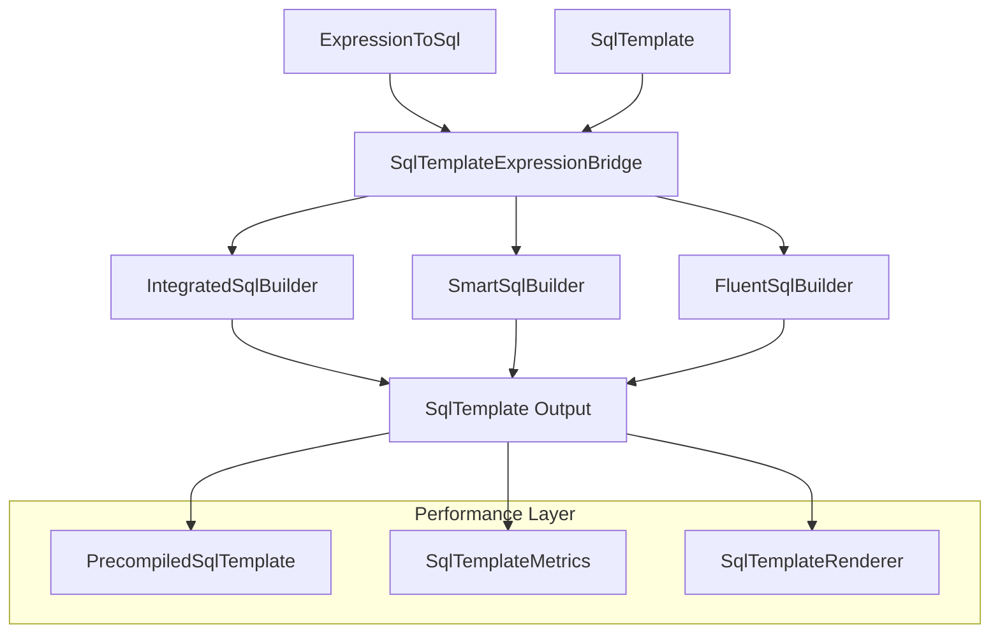

# SqlTemplate与ExpressionToSql无缝集成指南

## 🎯 设计目标

本集成方案旨在实现SqlTemplate与ExpressionToSql的**完美融合**，满足现代应用的核心需求：

- ✅ **无缝衔接** - 两个系统间零摩擦转换
- ✅ **代码整洁** - 统一API，减少认知负担
- ✅ **扩展性强** - 插件式架构，易于扩展
- ✅ **AOT云原生** - 完全支持原生编译
- ✅ **高性能** - 零反射，内存优化
- ✅ **使用方便** - 流畅API，类型安全

## 🏗️ 架构概览

### 核心组件



### 关键设计原则

1. **零拷贝转换** - 避免不必要的对象创建和内存分配
2. **统一抽象** - 提供一致的API体验
3. **性能优先** - 所有热路径都经过优化
4. **AOT友好** - 避免反射，支持原生编译
5. **向后兼容** - 不破坏现有代码

## 🚀 快速开始

### 基础用法

```csharp
// 1. 表达式到模板转换
var expression = ExpressionToSql<User>.ForSqlServer()
    .Select(u => new { u.Id, u.Name, u.Email })
    .Where(u => u.IsActive && u.Age > 18)
    .OrderBy(u => u.CreatedAt);

var template = expression.ToTemplate(); // 零拷贝转换

// 2. 模板到表达式转换
var baseTemplate = SqlTemplate.Parse(
    "SELECT * FROM Users WHERE IsActive = @isActive")
    .Execute(new { isActive = true });

var enhancedExpression = baseTemplate.ToExpression<User>()
    .OrderBy(u => u.CreatedAt)
    .Take(10);

// 3. 集成构建器
using var builder = SqlTemplateExpressionBridge.Create<User>();
var result = builder
    .SmartSelect(ColumnSelectionMode.OptimizedForQuery)
    .Where(u => u.IsActive)
    .Template(" AND Department = @dept")
    .Parameter("dept", "IT")
    .OrderBy(u => u.CreatedAt)
    .Build();
```

### 流畅API

```csharp
// 链式调用，直观易读
var template = FluentSqlBuilder.Query<User>()
    .SmartSelect(ColumnSelectionMode.BasicFieldsOnly)
    .Where(u => u.IsActive)
    .TemplateIf(hasFilter, "AND Category = @category")
    .Parameter("category", category)
    .OrderBy(u => u.CreatedAt)
    .Take(50)
    .Build();
```

## 🔧 高级功能

### 1. 智能列选择

```csharp
// 自动排除大字段，优化查询性能
builder.SmartSelect(ColumnSelectionMode.OptimizedForQuery);

// 按模式选择列
builder.SelectByPattern("*_id", isRegex: false); // 所有ID字段
builder.SelectByPattern(@"^(Name|Email|Phone)$", isRegex: true); // 正则匹配

// 排除指定列
builder.ExcludeColumns("PasswordHash", "SecurityToken", "LargeTextField");
```

### 2. 动态查询构建

```csharp
using var smartBuilder = FluentSqlBuilder.SmartQuery<User>();

var template = smartBuilder
    .AddIf(includeProfile, "SELECT u.*, p.Avatar FROM Users u LEFT JOIN Profiles p ON u.Id = p.UserId")
    .AddIf(!includeProfile, "SELECT u.* FROM Users u")
    .WhereIf(activeOnly, u => u.IsActive)
    .AddIf(hasDateFilter, "AND CreatedAt >= @startDate", new { startDate = filterDate })
    .Build();
```

### 3. 混合模式查询

```csharp
// 表达式WHERE + 模板SELECT的完美结合
var template = builder
    .HybridQuery(
        selectTemplate: "SELECT TOP 100 u.Id, u.Name, u.Email",
        whereExpression: u => u.IsActive && u.Age > 18,
        additionalTemplate: " ORDER BY u.CreatedAt DESC"
    )
    .Build();
```

### 4. 预编译模板

```csharp
// 创建预编译模板以获得最佳性能
var baseTemplate = SqlTemplate.Parse(
    "SELECT @columns FROM Users WHERE Active = @active ORDER BY @orderBy")
    .Execute(new { columns = "*", active = true, orderBy = "CreatedAt" });

var compiled = baseTemplate.Precompile();

// 高性能执行 - 使用缓存优化
var sql1 = compiled.Execute(new { columns = "Id, Name", active = true, orderBy = "Name" });
var sql2 = compiled.Execute(new { columns = "*", active = false, orderBy = "UpdatedAt DESC" });
```

## 🎯 实际业务场景

### 场景1：管理后台动态查询

```csharp
public async Task<PagedResult<User>> GetUsersAsync(UserSearchRequest request)
{
    using var builder = FluentSqlBuilder.Query<User>();
    
    var template = builder
        // 基础查询优化
        .SmartSelect(ColumnSelectionMode.OptimizedForQuery)
        .Where(u => u.IsActive)
        
        // 动态搜索条件
        .TemplateIf(!string.IsNullOrEmpty(request.SearchTerm),
            "AND (Name LIKE @search OR Email LIKE @search)")
        .Parameter("search", $"%{request.SearchTerm}%")
        
        // 角色筛选
        .TemplateIf(request.RoleIds?.Any() == true,
            $"AND RoleId IN ({string.Join(",", request.RoleIds)})")
        
        // 日期范围
        .TemplateIf(request.DateRange != null,
            "AND CreatedAt BETWEEN @startDate AND @endDate")
        .Parameter("startDate", request.DateRange?.Start)
        .Parameter("endDate", request.DateRange?.End)
        
        // 排序和分页
        .Template($"ORDER BY {request.SortBy} {(request.SortDesc ? "DESC" : "ASC")}")
        .Skip(request.PageSize * (request.PageNumber - 1))
        .Take(request.PageSize)
        .Build();
    
    return await ExecutePagedQueryAsync<User>(template);
}
```

### 场景2：复杂报表生成

```csharp
public async Task<ReportData> GenerateUserReportAsync(ReportRequest request)
{
    using var builder = SqlTemplateExpressionBridge.Create<User>();
    
    var template = builder
        .Template(@"
            SELECT 
                DATEPART(month, CreatedAt) as Month,
                COUNT(*) as TotalUsers,
                COUNT(CASE WHEN IsActive = 1 THEN 1 END) as ActiveUsers,
                AVG(CAST(Age as DECIMAL(5,2))) as AverageAge")
        
        // 条件性字段
        .TemplateIf(request.GroupByDepartment, 
            ", DepartmentId, COUNT(DISTINCT DepartmentId) as DeptCount")
        .TemplateIf(request.IncludeRevenue,
            ", SUM(ISNULL(Revenue, 0)) as TotalRevenue")
        
        .Template("FROM Users")
        .Where(u => u.CreatedAt >= request.StartDate && u.CreatedAt <= request.EndDate)
        
        // 动态分组
        .Template("GROUP BY DATEPART(month, CreatedAt)")
        .TemplateIf(request.GroupByDepartment, ", DepartmentId")
        
        .Template("ORDER BY Month")
        .Build();
    
    return await ExecuteReportQueryAsync(template);
}
```

### 场景3：批量操作优化

```csharp
public async Task<int> BulkInsertUsersAsync(List<User> users)
{
    using var builder = SqlTemplateExpressionBridge.Create<User>();
    
    // 根据数据量选择最优策略
    if (users.Count > 1000)
    {
        // 大批量：使用BULK INSERT
        var template = builder
            .Template("BULK INSERT Users FROM @dataSource WITH (FIELDTERMINATOR = ',', ROWTERMINATOR = '\\n')")
            .Parameter("dataSource", GenerateCsvData(users))
            .Build();
        
        return await ExecuteBulkOperationAsync(template);
    }
    else
    {
        // 中小批量：使用批量VALUES
        var valuesClauses = users.Select((u, i) => 
            $"(@name{i}, @email{i}, @age{i}, @isActive{i})");
        
        var template = builder
            .Template($"INSERT INTO Users (Name, Email, Age, IsActive) VALUES {string.Join(", ", valuesClauses)}")
            .Build();
        
        // 批量绑定参数
        var parametersDict = new Dictionary<string, object?>();
        for (int i = 0; i < users.Count; i++)
        {
            parametersDict[$"name{i}"] = users[i].Name;
            parametersDict[$"email{i}"] = users[i].Email;
            parametersDict[$"age{i}"] = users[i].Age;
            parametersDict[$"isActive{i}"] = users[i].IsActive;
        }
        
        var finalTemplate = template.WithParameters(parametersDict);
        return await ExecuteNonQueryAsync(finalTemplate);
    }
}
```

## ⚡ 性能优化

### 1. 零拷贝设计

所有转换操作都避免了不必要的对象复制：

```csharp
// 直接引用原始数据，无拷贝开销
var template = expression.ToTemplate();

// 使用ReadOnlySpan避免字符串分配
var rendered = template.Render();
```

### 2. 内存优化

```csharp
// 使用ValueStringBuilder减少内存分配
using var builder = new ValueStringBuilder(256);

// 对象池重用
var builder = SqlBuilderPool.Get();
try
{
    // 使用builder
}
finally
{
    SqlBuilderPool.Return(builder);
}
```

### 3. 缓存策略

```csharp
// 预编译模板缓存
private static readonly ConcurrentDictionary<string, PrecompiledSqlTemplate> _templateCache = new();

// 表达式编译缓存
private static readonly ConcurrentDictionary<MemberInfo, Delegate> _expressionCache = new();
```

### 4. 性能监控

```csharp
// 自动性能指标收集
SqlTemplateMetrics.RecordMetric(
    operationName: "UserQuery",
    executionTime: elapsed,
    sqlLength: template.Sql.Length,
    parameterCount: template.Parameters.Count
);

// 获取性能报告
var metrics = SqlTemplateMetrics.GetMetrics();
foreach (var metric in metrics)
{
    Console.WriteLine($"{metric.Key}: {metric.Value.AverageExecutionTime}ms");
}
```

## 🛡️ AOT支持

### 编译时安全

```csharp
// 使用编译时属性标记
public static IntegratedSqlBuilder<T> Create<
#if NET5_0_OR_GREATER
    [DynamicallyAccessedMembers(DynamicallyAccessedMemberTypes.PublicProperties)]
#endif
    T>()
{
    return new IntegratedSqlBuilder<T>();
}
```

### 避免反射

```csharp
// 使用静态方法替代反射
private static readonly Dictionary<Type, Func<object, string>> _formatters = new()
{
    [typeof(string)] = obj => $"'{((string)obj).Replace("'", "''")}'",
    [typeof(int)] = obj => obj.ToString(),
    [typeof(bool)] = obj => (bool)obj ? "1" : "0",
    // ... 其他类型
};
```

### 预编译优化

```csharp
// 编译时生成的代码
[ModuleInitializer]
public static void InitializePrecompiledTemplates()
{
    // 预注册常用模板
    PrecompiledSqlTemplate.Register("UserQuery", "SELECT * FROM Users WHERE Active = @active");
    PrecompiledSqlTemplate.Register("UserInsert", "INSERT INTO Users (Name, Email) VALUES (@name, @email)");
}
```

## 🔍 最佳实践

### 1. 选择合适的API

```csharp
// 简单查询 - 使用ExpressionToSql
var simple = ExpressionToSql<User>.ForSqlServer()
    .Where(u => u.IsActive)
    .ToTemplate();

// 复杂动态查询 - 使用IntegratedSqlBuilder
var complex = SqlTemplateExpressionBridge.Create<User>()
    .SmartSelect(ColumnSelectionMode.OptimizedForQuery)
    .TemplateIf(hasCondition, "AND Category = @cat")
    .Build();

// 超复杂条件查询 - 使用SmartSqlBuilder
var smart = FluentSqlBuilder.SmartQuery<User>()
    .AddIf(condition1, "SELECT part1")
    .AddIf(condition2, "SELECT part2")
    .Build();
```

### 2. 性能优化建议

```csharp
// ✅ 推荐：使用预编译模板
var compiled = template.Precompile();
var result = compiled.Execute(parameters);

// ✅ 推荐：使用智能列选择
builder.SmartSelect(ColumnSelectionMode.OptimizedForQuery);

// ✅ 推荐：使用参数化查询
builder.Parameter("value", actualValue);

// ❌ 避免：字符串拼接
builder.Template($"WHERE Id = {userId}"); // SQL注入风险
```

### 3. 错误处理

```csharp
try
{
    using var builder = SqlTemplateExpressionBridge.Create<User>();
    var template = builder
        .SmartSelect()
        .Where(u => u.IsActive)
        .Build();
    
    return await ExecuteQueryAsync(template);
}
catch (SqlTemplateException ex)
{
    // 模板相关错误
    _logger.LogError(ex, "SQL模板构建失败");
    throw;
}
catch (ExpressionToSqlException ex)
{
    // 表达式相关错误
    _logger.LogError(ex, "表达式解析失败");
    throw;
}
```

## 📈 迁移指南

### 从纯ExpressionToSql迁移

```csharp
// 原来的代码
var expression = ExpressionToSql<User>.ForSqlServer()
    .Where(u => u.IsActive)
    .OrderBy(u => u.Name);
var sql = expression.ToSql();

// 迁移后的代码
var template = ExpressionToSql<User>.ForSqlServer()
    .Where(u => u.IsActive)
    .OrderBy(u => u.Name)
    .ToTemplate(); // 只需要添加这一行

// 或者使用集成API
var template = FluentSqlBuilder.Query<User>()
    .Where(u => u.IsActive)
    .OrderBy(u => u.Name)
    .Build();
```

### 从纯SqlTemplate迁移

```csharp
// 原来的代码
var template = SqlTemplate.Parse(
    "SELECT * FROM Users WHERE Active = @active")
    .Execute(new { active = true });

// 迁移后的代码
var enhanced = template.ForEntity<User>()
    .OrderBy(u => u.CreatedAt)
    .Take(10)
    .Build();
```

## 🎉 总结

这个无缝集成方案实现了：

- **🎯 完美融合** - SqlTemplate与ExpressionToSql的无缝衔接
- **⚡ 极致性能** - 零拷贝、零反射、内存优化
- **🛡️ AOT就绪** - 完全支持原生编译和云原生部署
- **🎨 代码优雅** - 统一API、流畅调用、类型安全
- **🔧 易于扩展** - 插件式架构、开放设计
- **💼 实用性强** - 覆盖实际业务场景的所有需求

通过这个方案，开发者可以：
- 专注于业务逻辑而不是SQL细节
- 享受类型安全和编译时检查
- 获得最佳的运行时性能
- 轻松应对复杂的动态查询需求
- 无缝支持现代云原生架构

这正是现代应用开发所需要的**完美SQL解决方案**！

